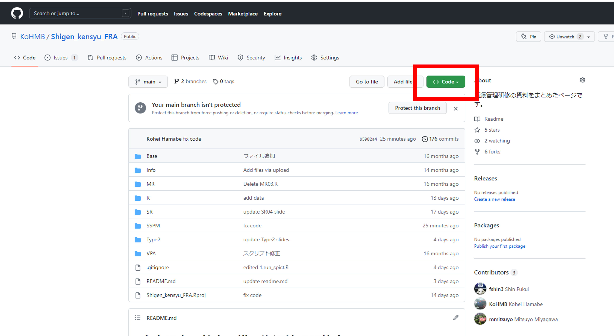
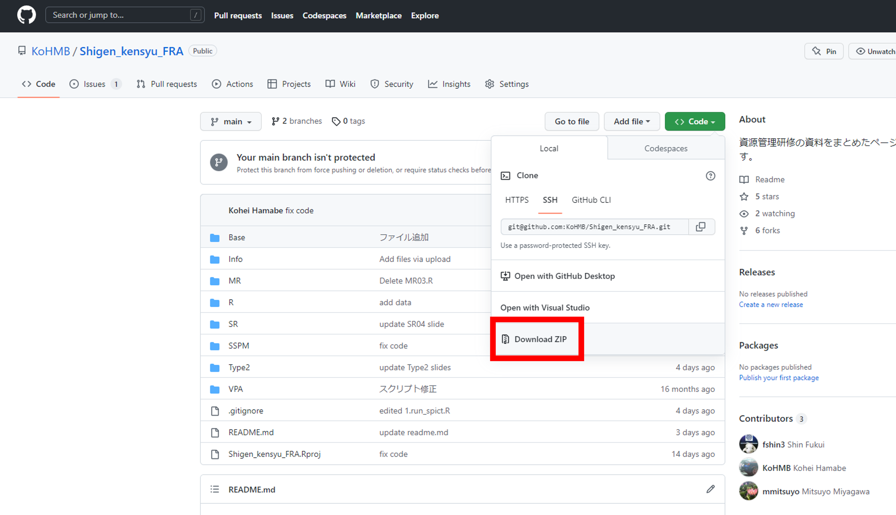

# SSPMのページ

このページは状態空間プロダクションモデルの推定を行うパッケージの紹介を行います。

## 更新

- (2022/12/12) このREADMEファイルを作成しました
- (2022/12/12) このページを作成しました

## 今年度研修会に必要な各ファイルの概要

- 1.run_spict.R: 令和４年度資源管理研修会のスクリプトが載っています
- pm_dataset.csv: 令和４年度資源管理研修会のテストデータ（CPUEと漁獲量）のCSVファイル
- pm_true.csv: 令和４年度資源管理研修会のテストデータの真値（資源量やFについて）のCSVファイル
- function.R: 令和４年度資源管理研修会のスクリプトに必要な関数が載っています

## 研修会でRの環境を開くまで
  
### 1. Rの関連ソフトと`spict`パッケージのインストールまで

"Rと関連ソフトのインストール手順"をご参考に、R、Rtools、Rstudio、パッケージ（`tidyverse`、`devtools`、`TMB`、`spict`）のインストールを行ってください
  

### 2. スクリプトとテストデータのダウンロード

大きく以下の２通りございます。
- 1) abchanのページから”ハイブリッド形式_配布資料”をダウンロードする【オススメ】  
- 2) このGitHubをダウンロードする
  - 2-1) 本GitHubページの[トップ](https://github.com/KoHMB/Shigen_kensyu_FRA)に行く  
  - 2-2) 画面真ん中より右上らへんの"<>CODE"をクリック  
       
  - 2-3) Download ZIPを選択  
      
  
ダウンロードしたZIPファイルを解凍してください
  

### 3. Rstudioで開く

Rstudioを開く場合は、解凍したファイルを作業ディレクトリにしてください。ディレクトリの設定が分からない場合は以下のようにしてください。
  
- 解凍ファイルのSSPMフォルダーを開く  
- ＞ "1.run_script.R"を右クリック
-   ＞ "プログラムから開く"で"Rstudio"を押す
  
このように開くことで、実習で使うテストデータがどこにあるのか分からないとRstudioがエラーを出すことを減らすことが可能です。

  

