-   [はじめに](#はじめに)
-   [0. 準備](#準備)
-   [1. チューニング無VPA](#チューニング無vpa)
-   [2. チューニングVPA](#チューニングvpa)
    -   [2-1．最小二乗法推定](#最小二乗法推定)
        -   [モデル診断1: 残差プロット](#モデル診断1-残差プロット)
        -   [モデル診断2:
            レトロスペクティブ解析](#モデル診断2-レトロスペクティブ解析)
    -   [2-2．最尤推定法](#最尤推定法)
        -   [モデル診断1: 残差プロット](#モデル診断1-残差プロット-1)
        -   [モデル診断2:
            レトロスペクティブ解析](#モデル診断2-レトロスペクティブ解析-1)
        -   [重みを少しまとめた解析](#重みを少しまとめた解析)
        -   [モデル診断1: 残差プロット](#モデル診断1-残差プロット-2)
        -   [モデル診断2:
            レトロスペクティブ解析](#モデル診断2-レトロスペクティブ解析-2)
        -   [モデル選択](#モデル選択)
        -   [観測誤差がデータ間で等分散の最尤推定法(=最小二乗法)](#観測誤差がデータ間で等分散の最尤推定法最小二乗法)
    -   [2-3. bの考慮](#bの考慮)
        -   [モデル診断1: 残差プロット](#モデル診断1-残差プロット-3)
        -   [モデル診断2:
            レトロスペクティブ解析](#モデル診断2-レトロスペクティブ解析-3)
    -   [ggplot小話](#ggplot小話)
    -   [2-4. 全F推定法](#全f推定法)
    -   [Index3を取り除いてみる](#index3を取り除いてみる)
        -   [モデル診断2:
            レトロスペクティブ解析](#モデル診断2-レトロスペクティブ解析-4)
-   [3. VPA計算結果まとめ](#vpa計算結果まとめ)
-   [4. VPAのモデル診断](#vpaのモデル診断)
    -   [4-3. ジッター解析](#ジッター解析)
    -   [4-4. 感度分析](#感度分析)
        -   [成熟率](#成熟率)
    -   [4-5. ジャックナイフ法](#ジャックナイフ法)
    -   [4-6. ブートストラップ法](#ブートストラップ法)
        -   [信頼区間の計算](#信頼区間の計算)
        -   [パラメータ間の相関](#パラメータ間の相関)
-   [資料・参考文献](#資料参考文献)

はじめに
========

-   実際にある資源のデータを使ってVPA計算とモデル診断を模擬的に行います

-   資源管理研修用に少し調整したデータとなっています

-   **本研修はフィクションで、実際の資源評価とは関係ありません**

-   データについてモデル診断を通してコメントするシーンがありますが、これは実際の資源評価のデータに対してのものと異なります

-   実データに基づいていますが、あくまで研修の例題として考えてください

それでは、始めます

0. 準備
=======

まずは以下のようにして`frasyr`を呼び出します。

    library(frasyr)

もし`frasyr`をインストールされていない場合は、[こちら](https://github.com/ichimomo/frasyr)のサイトを参考にインストールを試みてください

データの読み込みと、直近の資源量指標値について確認します

    caa  <- read.csv("data/caa0_2020.csv", row.names = 1)
    waa  <- read.csv("data/waa1_2020.csv", row.names = 1)
    maa  <- read.csv("data/maa2_2020.csv", row.names = 1)
    cpue <- read.csv("data/cpue2_aicc2020.csv", row.names = 1)
    dat  <- data.handler(caa, waa, maa, cpue, M=0.4)
    dat$index[1:2,"2018"] <- NA 

    cpue2 <- cpue
    cpue2[1,] <- (cpue[1,]/
                    mean(as.numeric(cpue[1,]), na.rm=TRUE))
    cpue2[2,] <- (cpue[2,]/
                    mean(as.numeric(cpue[2,]), na.rm=TRUE))
    cpue2[3,] <- (cpue[3,]/
                    mean(as.numeric(cpue[3,]), na.rm=TRUE))
    cpue2[4,] <- (cpue[4,]/
                    mean(as.numeric(cpue[4,]), na.rm=TRUE))
    matplot(1970:2018,t(cpue2), type = "l", xlim = c(2000,2018),
            ylab = "基準化CPUE")
    legend("topleft", legend = c("index1","index2","index3","index4"),
           col = 1:4, lty=1:4, ncol=2)

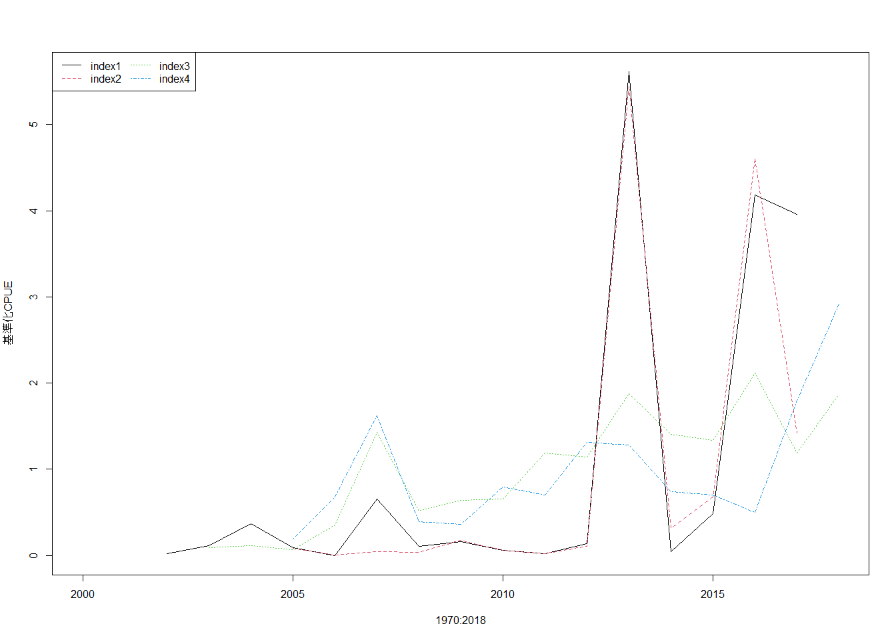

資源量指数は全体として増加傾向にあるみたいです。
特に、加入の指数であるIndex1とIndex2は2013年に大きな値を取っています。

1. チューニング無VPA
====================

VPAは年齢別漁獲尾数データから資源量計算が可能な解析手法です。
まずは年齢別漁獲尾数データだけで資源計算をしていきたいと思います

    res1.1 <- vpa(dat=dat,
                  tf.year = 2015:2017,
                  plus.group = TRUE,
                  Pope = TRUE,
                  tune = FALSE,
                  p.init = 0.5
                  )

    ## Warning in nlm(p.est, log(p.init), hessian = hessian): NA/Inf は正の最大値で置き
    ## 換えられました

    ## Warning in nlm(p.est, log(p.init), hessian = hessian): NA/Inf は正の最大値で置き
    ## 換えられました

    ## Warning in nlm(p.est, log(p.init), hessian = hessian): NA/Inf は正の最大値で置き
    ## 換えられました

    ## Warning in nlm(p.est, log(p.init), hessian = hessian): NA/Inf は正の最大値で置き
    ## 換えられました

    res1.1$faa[,as.character(2013:2017)]

    ##         2013       2014       2015      2016 2017
    ## 0 0.02528343 0.06180418 0.04091019 0.3926173  Inf
    ## 1 0.23473894 0.11049708 0.12867685 0.3056949  Inf
    ## 2 0.28376790 0.30533974 0.35776323 0.3174360  Inf
    ## 3 0.64226932 0.54832754 0.53334540 0.7444189  Inf
    ## 4 0.28209991 0.35898387 0.31553981 0.3061173  Inf
    ## 5 1.19558458 0.44157478 0.53660482 0.7312367  Inf
    ## 6 1.19558458 0.44157478 0.53660482 0.7312367  Inf

    # 最終年のFの平均年数を変えてみる
    res1.2 <- vpa(dat=dat,
                  tf.year = 2013:2017,
                  plus.group = TRUE,
                  Pope = TRUE,
                  tune = FALSE,
                  p.init = 0.5
                  )

    ## Warning in nlm(p.est, log(p.init), hessian = hessian): NA/Inf は正の最大値で置き
    ## 換えられました

    ## Warning in nlm(p.est, log(p.init), hessian = hessian): NA/Inf は正の最大値で置き
    ## 換えられました

    ## Warning in nlm(p.est, log(p.init), hessian = hessian): NA/Inf は正の最大値で置き
    ## 換えられました

    ## Warning in nlm(p.est, log(p.init), hessian = hessian): NA/Inf は正の最大値で置き
    ## 換えられました

    res1.2$faa[,as.character(2013:2017)]

    ##         2013       2014       2015      2016 2017
    ## 0 0.02528343 0.06180418 0.04091019 0.3926173  Inf
    ## 1 0.23473894 0.11049708 0.12867685 0.3056949  Inf
    ## 2 0.28376790 0.30533974 0.35776323 0.3174360  Inf
    ## 3 0.64226932 0.54832754 0.53334540 0.7444189  Inf
    ## 4 0.28209991 0.35898387 0.31553981 0.3061173  Inf
    ## 5 1.19558458 0.44157478 0.53660482 0.7312367  Inf
    ## 6 1.19558458 0.44157478 0.53660482 0.7312367  Inf

    # プロットをしてみる
    plot_vpa(list(res1.1, res1.2))

    ## Warning: Removed 2 rows containing missing values (geom_point).

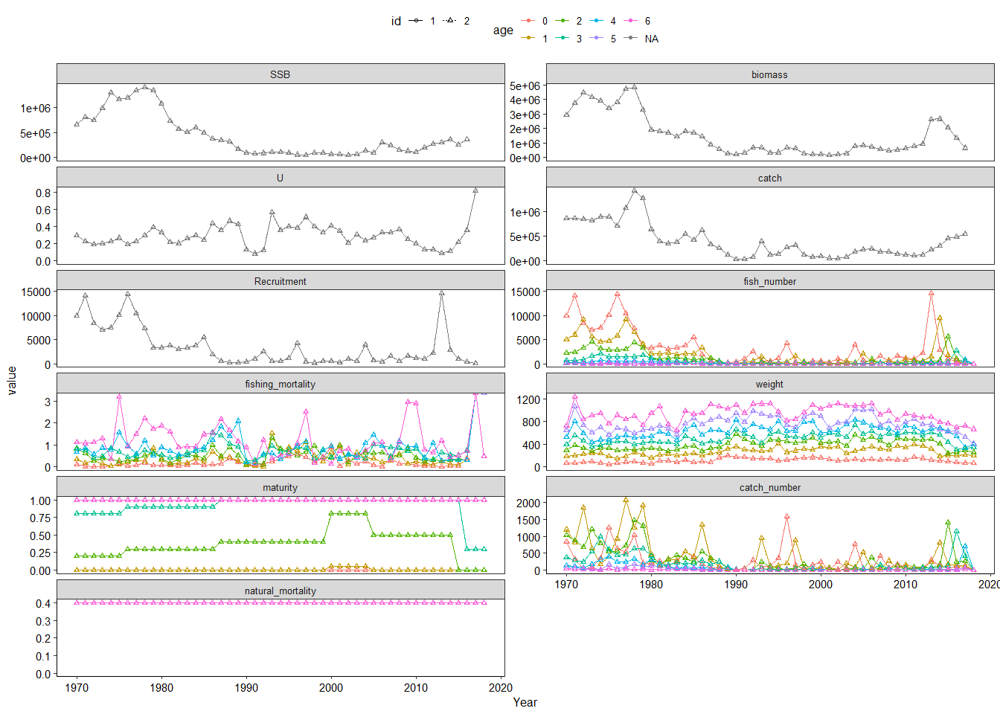

**まずは最近年のFが推定できているかチェック**

-   最終年のFの推定が収束していない
-   漁獲量データから資源動態を推定するのは難しい…
-   ならば最近年の情報を足して、もう少しデータに基づいた資源評価をしてみよう
-   ちょうどいいところに**CPUE**があるぞ!

2. チューニングVPA
==================

VPAは最近年の推定値の不確実性が大きいという特性を持っています.  
そこで、資源量指標値のトレンドにフィットさせることで、更に情報の持った資源量推定ができます.  
これをチューニングVPAといい、チューニングVPAには最適化手法や推定するFの対象に応じて様々な仕様があります.

2-1．最小二乗法推定
-------------------

-   今、４つの資源量指標値があります
-   それぞれの資源量指標値の重み（信頼度のようなもの）を等しいとして計算します

<!-- -->

    res2.1 <- vpa(dat=dat,
                  tf.year = 2015:2017,
                  plus.group = TRUE,
                  last.catch.zero = TRUE,
                  Pope = TRUE,
                  tune = TRUE, #チューニングをする場合はTRUE
                  alpha = 1, #最高齢のFと(最高齢-1)歳のFの比
                  sel.update = TRUE,
                             #選択率更新法(最終年最高齢をターミナルFにする場合はTRUEに)
                  est.method = "ls", #最適化手法は最小二乗法
                  term.F = "max", #推定する最終年のFは最高齢のFを一つ推定
                  abund = c("N","N","SSB","SSB"), #資源量指標値が何に対応しているか
                  min.age = c(0,0,0,0), #資源量指標値が対応している年齢の下限
                  max.age = c(0,0,6,6), #資源量指標値が対応している年齢の上限
                  use.index = 1:4, #どの資源量指標値を使うか
                  plot = TRUE,
                  plot.year = 2002:2018
                  )

    ## Warning in nlm(p.est, log(p.init), hessian = hessian): NA/Inf は正の最大値で置き
    ## 換えられました

    ## `geom_smooth()` using method = 'loess' and formula 'y ~ x'

    ## Warning: Removed 137 rows containing non-finite values (stat_smooth).

    ## Warning: Removed 137 rows containing missing values (geom_point).

    ## Warning: Removed 137 rows containing missing values (geom_point).

    ## Warning: Removed 128 row(s) containing missing values (geom_path).

    ## Warning: Removed 137 rows containing missing values (geom_point).

    res2.1$faa[,as.character(2013:2017)]

    ##          2013       2014        2015       2016       2017
    ## 0 0.008065303 0.01524298 0.004641667 0.01613209 0.01228393
    ## 1 0.125696604 0.03364325 0.029520889 0.02978417 0.03440618
    ## 2 0.184260087 0.14295076 0.092203665 0.06117555 0.08833886
    ## 3 0.446079125 0.30146472 0.195882351 0.12543881 0.18495444
    ## 4 0.190327469 0.20854436 0.139675416 0.08444706 0.12888234
    ## 5 0.909479347 0.26088313 0.252274461 0.23518186 0.28240884
    ## 6 0.909479347 0.26088313 0.252274461 0.23518186 0.28240884

    # プロットをしてみる
    plot_vpa(list(VPA = res1.1, tVPA = res2.1), 
             what.plot = c("SSB", "biomass", "U", "Recruitment",
                           "fish_number", "fishing_mortality"))

    ## Warning: Removed 2 rows containing missing values (geom_point).

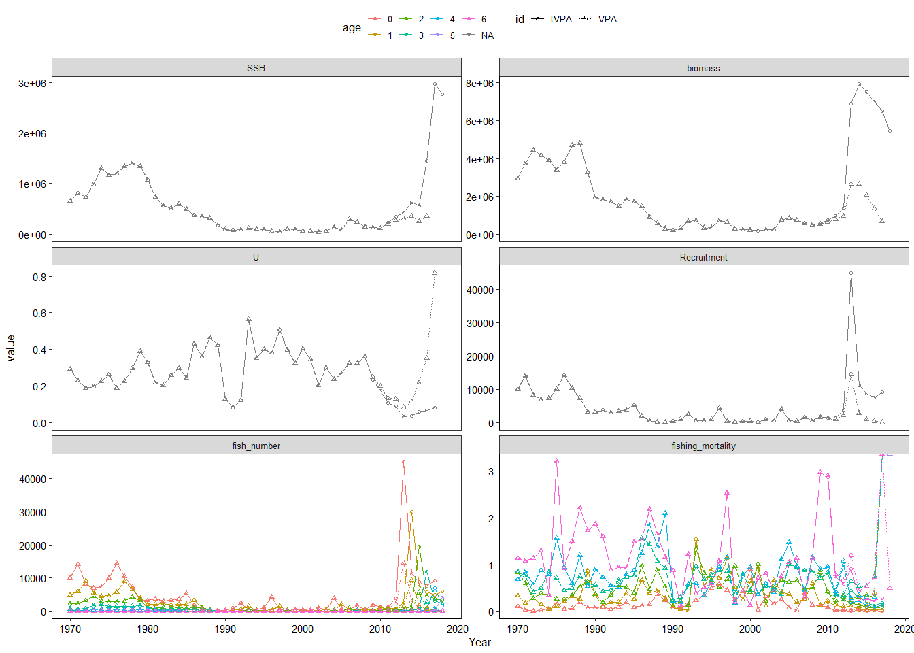

### モデル診断1: 残差プロット

    resid2.1 <- plot_residual_vpa(res2.1, plot_year = 2000:2018)
    resid2.1$year_resid

    ## `geom_smooth()` using method = 'loess' and formula 'y ~ x'

    ## Warning: Removed 137 rows containing non-finite values (stat_smooth).

    ## Warning: Removed 137 rows containing missing values (geom_point).

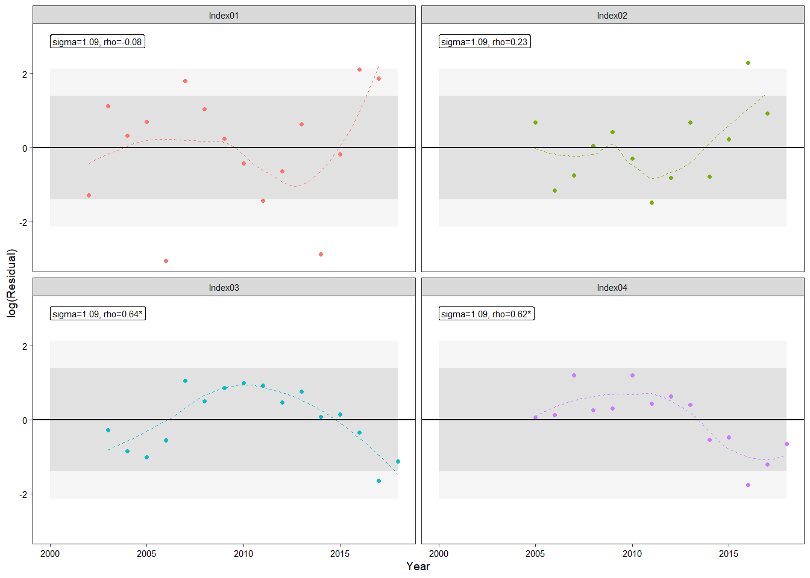

    resid2.1$fitting_Index

    ## Warning: Removed 137 rows containing missing values (geom_point).

    ## Warning: Removed 120 row(s) containing missing values (geom_path).

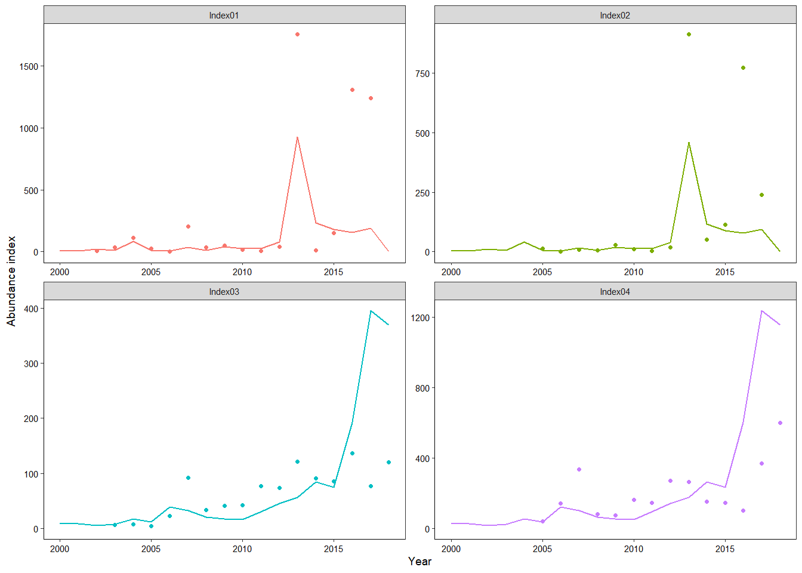

    resid2.1$abund_Index

    ## Warning: Removed 137 rows containing missing values (geom_point).

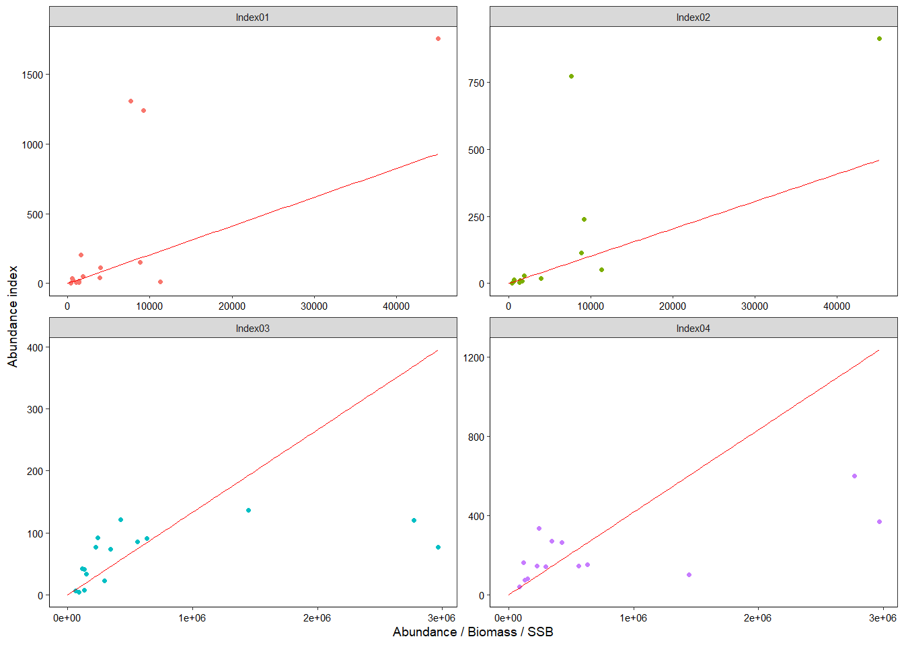

### モデル診断2: レトロスペクティブ解析

    retro2.1 <- do_retrospective_vpa(res2.1)

    ## Warning in nlm(p.est, log(p.init), hessian = hessian): NA/Inf は正の最大値で置き
    ## 換えられました

    ## Warning in nlm(p.est, log(p.init), hessian = hessian): NA/Inf は正の最大値で置き
    ## 換えられました

    ## Warning in nlm(p.est, log(p.init), hessian = hessian): NA/Inf は正の最大値で置き
    ## 換えられました

    ## Warning in nlm(p.est, log(p.init), hessian = hessian): NA/Inf は正の最大値で置き
    ## 換えられました

    ## Joining, by = "index"

    ## New names:
    ## * value -> value...1
    ## * value -> value...2
    ## * value -> value...3
    ## * value -> value...4
    ## * value -> value...5

    retro2.1$graph

    ## Warning: Removed 6 rows containing missing values (geom_point).

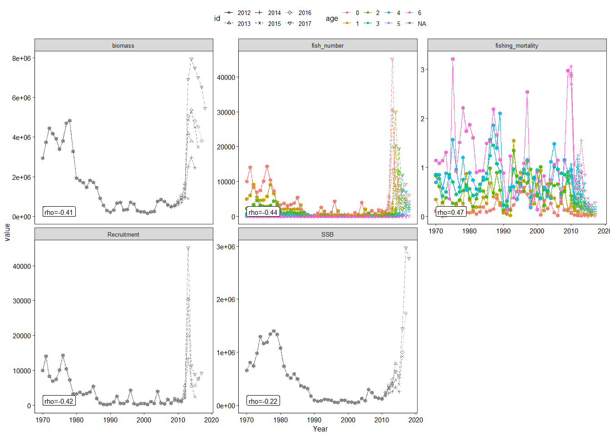

-   資源量指標値の情報を加えることで、先程までと異なりFの推定が安定したように見えます
-   ただし、最近SSBが本当に増えているのでしょうか?
-   確認するにはいろんな方法がありますが、まずは自分でできること、データの扱い方でもう少し検討していきたいと思います

2-2．最尤推定法
---------------

-   先程の最小二乗法の残差プロットを見ます
-   加入の指標を表すindex1とindex2に対して、親魚の指標であるindex3とindex4は残差が小さく見えます
-   また、残差には時系列に対して独立であるという仮定がありますが、index2やindex4は最近の残差が大きく見えます

特に2番目の残差の大きさの違いについては、最尤推定法という最適化手法を選ぶことで対処することができます。最尤推定法では1つ1つの**資源量指数の重みを分けて推定**することができます

    res3.1 <- vpa(dat=dat,
                  tf.year = 2015:2017,
                  plus.group = TRUE,
                  last.catch.zero = TRUE,
                  Pope = TRUE,
                  tune = TRUE,
                  alpha = 1,
                  sel.update = TRUE,
                  est.method = "ml", #最適化手法を最尤推定法に
                  term.F = "max",
                  abund = c("N","N","SSB","SSB"),
                  min.age = c(0,0,0,0),
                  max.age = c(0,0,6,6),
                  use.index = 1:4,
                  sigma.constraint = c(1,2,3,4),
                  plot = TRUE,
                  plot.year = 2002:2018
                  )

    ## `geom_smooth()` using method = 'loess' and formula 'y ~ x'

    ## Warning: Removed 137 rows containing non-finite values (stat_smooth).

    ## Warning: Removed 137 rows containing missing values (geom_point).

    ## Warning: Removed 137 rows containing missing values (geom_point).

    ## Warning: Removed 128 row(s) containing missing values (geom_path).

    ## Warning: Removed 137 rows containing missing values (geom_point).

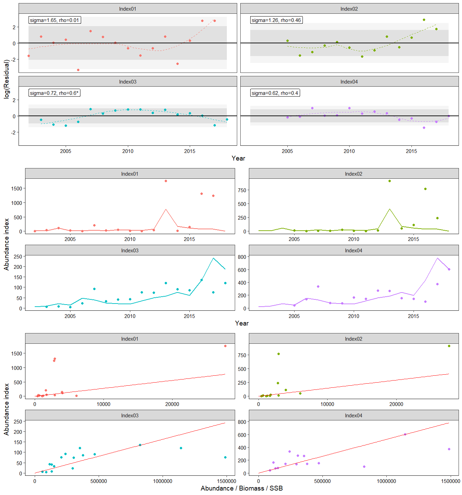

    # まずは年齢別漁獲尾数
    res3.1$faa[,as.character(2013:2017)]

    ##         2013       2014       2015       2016       2017
    ## 0 0.01317437 0.02857843 0.01037745 0.04317906 0.04070677
    ## 1 0.17323769 0.05570229 0.05646951 0.06806017 0.09625089
    ## 2 0.23239705 0.20839162 0.15953784 0.12224005 0.21936160
    ## 3 0.54394633 0.41028168 0.31226090 0.23713621 0.42776024
    ## 4 0.23560338 0.27709160 0.20817945 0.14753008 0.27725227
    ## 5 1.05756815 0.34389421 0.36674240 0.39091665 0.58675237
    ## 6 1.05756815 0.34389421 0.36674240 0.39091665 0.58675237

    # 観測誤差（各データの重み）を見る
    res3.1$sigma

    ## [1] 1.6461260 1.2569130 0.7207365 0.6209931

    # 資源動態の比較
    plot_vpa(list(non = res1.1, ls = res2.1, ml = res3.1),
             what.plot = c("SSB", "biomass", "U", "Recruitment",
                           "fish_number", "fishing_mortality"))

    ## Warning: Removed 3 rows containing missing values (geom_point).

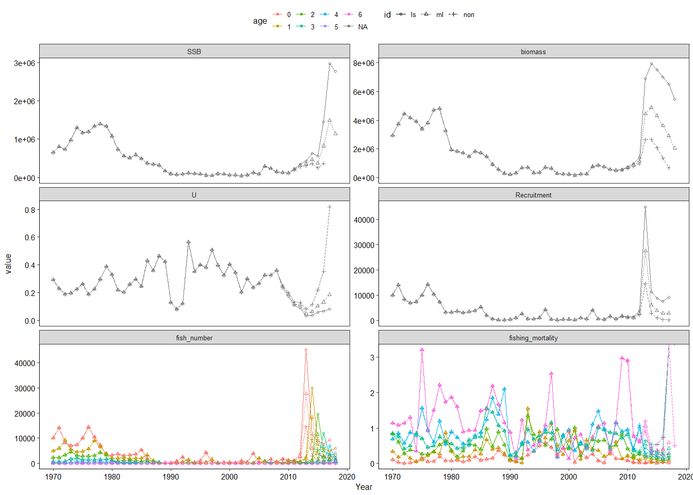

### モデル診断1: 残差プロット

-   残差プロットを比較してみよう

**patchworkパッケージが必要です!!**

    #install.packages("patchwork")  # パッケージのインストール
    #install.packages("ggplot2")  
    library(patchwork)             # パッケージの読み込み
    library(ggplot2)  

    resid3.1 <- plot_residual_vpa(res3.1, plot_year = 2000:2018)

    # 残差の時系列プロット
    resid2.1$year_resid+ggtitle("最小二乗法") | resid3.1$year_resid+ggtitle("最尤推定法")

    ## `geom_smooth()` using method = 'loess' and formula 'y ~ x'

    ## Warning: Removed 137 rows containing non-finite values (stat_smooth).

    ## Warning: Removed 137 rows containing missing values (geom_point).

    ## `geom_smooth()` using method = 'loess' and formula 'y ~ x'

    ## Warning: Removed 137 rows containing non-finite values (stat_smooth).

    ## Warning: Removed 137 rows containing missing values (geom_point).

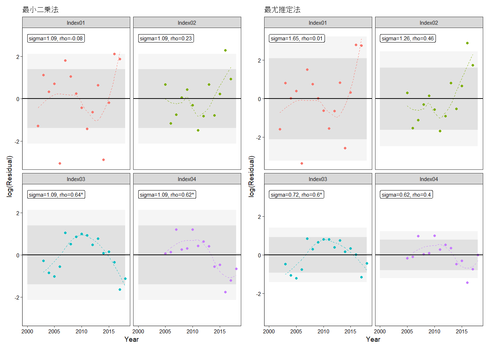

    # 資源量とのフィッティング
    resid2.1$fitting_Index+ggtitle("最小二乗法") | resid3.1$fitting_Index+ggtitle("最尤推定法")

    ## Warning: Removed 137 rows containing missing values (geom_point).

    ## Warning: Removed 120 row(s) containing missing values (geom_path).

    ## Warning: Removed 137 rows containing missing values (geom_point).

    ## Warning: Removed 120 row(s) containing missing values (geom_path).

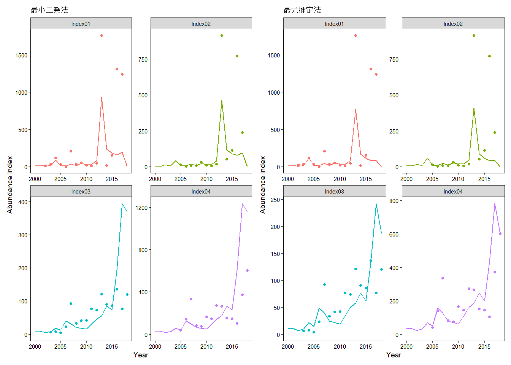

    # 資源量と指数の線形関係
    resid2.1$abund_Index+ggtitle("最小二乗法") |resid3.1$abund_Index+ggtitle("最尤推定法")

    ## Warning: Removed 137 rows containing missing values (geom_point).

    ## Warning: Removed 137 rows containing missing values (geom_point).

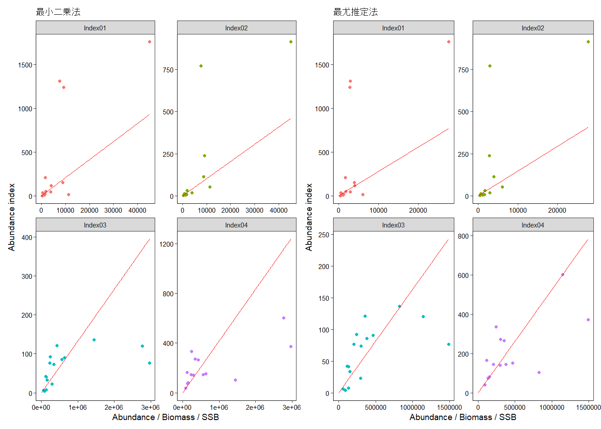

### モデル診断2: レトロスペクティブ解析

    retro3.1 <- do_retrospective_vpa(res3.1)

    ## Joining, by = "index"

    ## New names:
    ## * value -> value...1
    ## * value -> value...2
    ## * value -> value...3
    ## * value -> value...4
    ## * value -> value...5

    retro3.1$graph

    ## Warning: Removed 6 rows containing missing values (geom_point).

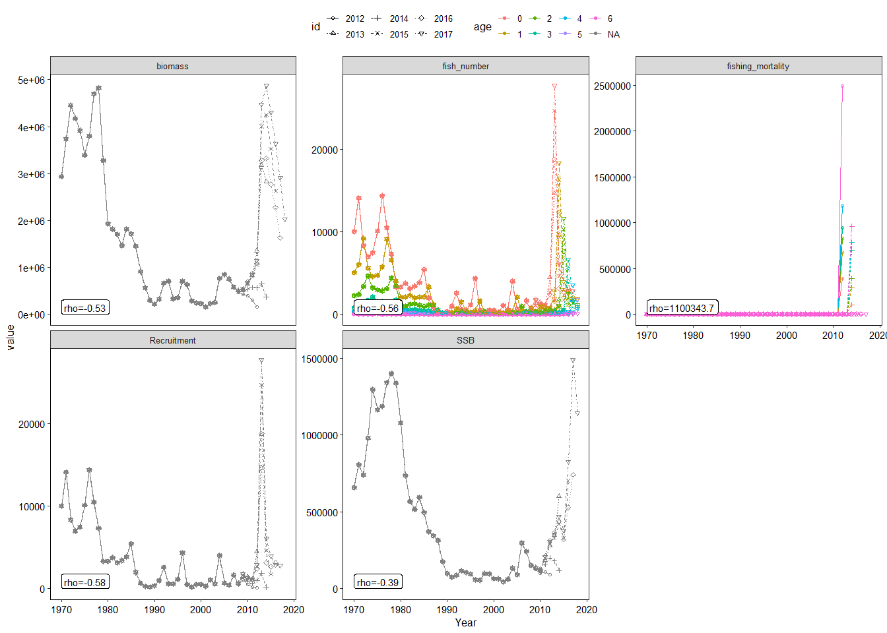

-   Mohn’s rhoが大きくなっちゃった
-   これは最尤法はデータごとに重み付けを出来る反面、データにオーバーフィットする傾向があることが要因の一つであると言える
-   2012年までは加入の指数は軒並み横ばいだったけど、SSBの指数は2008年頃から増加傾向にありました
    -このデータトレンドを説明するためにFを大きくしてモデルをフィットさせてしまったと考えられます
-   最小二乗法では加入と親魚の指数の重みを等しくしていたので、SSBの指数の傾向にフィットしすぎるということが見られず、結果としてレトロスペクティブ解析が安定しているといえます

### 重みを少しまとめた解析

-   加入の指数の観測誤差は1.2以上と大きめでした
-   一方、親魚の指数は0.65程と加入指数に比べて小さめでした
-   それぞれの指数の重みを出しましたが、加入か親魚かで2分しても推定が可能では？

<!-- -->

    res3.2 <- vpa(dat=dat,
                  tf.year = 2015:2017,
                  plus.group = TRUE,
                  last.catch.zero = TRUE,
                  Pope = TRUE,
                  tune = TRUE,
                  alpha = 1,
                  sel.update = TRUE,
                  est.method = "ml",
                  term.F = "max",
                  abund = c("N","N","SSB","SSB"),
                  min.age = c(0,0,0,0),
                  max.age = c(0,0,6,6),
                  use.index = 1:4,
                  sigma.constraint = c(1,1,2,2),
                  plot = TRUE,
                  plot.year = 2002:2018
                  )

    ## `geom_smooth()` using method = 'loess' and formula 'y ~ x'

    ## Warning: Removed 137 rows containing non-finite values (stat_smooth).

    ## Warning: Removed 137 rows containing missing values (geom_point).

    ## Warning: Removed 137 rows containing missing values (geom_point).

    ## Warning: Removed 128 row(s) containing missing values (geom_path).

    ## Warning: Removed 137 rows containing missing values (geom_point).

    # まずは年齢別漁獲尾数
    res3.2$faa[,as.character(2013:2017)]

    ##         2013       2014       2015       2016       2017
    ## 0 0.01337921 0.02917186 0.01067288 0.04476209 0.04262755
    ## 1 0.17484722 0.05659929 0.05769426 0.07007792 0.10004577
    ## 2 0.23388453 0.21074076 0.16240693 0.12514650 0.22691972
    ## 3 0.54687775 0.41392955 0.31685382 0.24236415 0.44135582
    ## 4 0.23697570 0.27932827 0.21069582 0.15026231 0.28521648
    ## 5 1.06182919 0.34658295 0.37084980 0.39734994 0.60280070
    ## 6 1.06182919 0.34658295 0.37084980 0.39734994 0.60280070

    # 重みの比較
    data.frame(Model = c(3.1, 3.2),
               index1 = c(res3.1$sigma[1], res3.2$sigma[1]),
               index2 = c(res3.1$sigma[2], res3.2$sigma[2]),
               index3 = c(res3.1$sigma[3], res3.2$sigma[3]),
               index4 = c(res3.1$sigma[4], res3.2$sigma[4])
               )

    ##   Model   index1   index2    index3    index4
    ## 1   3.1 1.646126 1.256913 0.7207365 0.6209931
    ## 2   3.2 1.492814 1.492814 0.6722345 0.6722345

    # 資源動態の比較
    plot_vpa(list(ls = res2.1, ml1 = res3.1, ml2 = res3.2),
             what.plot = c("SSB", "biomass", "U", "Recruitment",
                           "fish_number", "fishing_mortality"))

    ## Warning: Removed 3 rows containing missing values (geom_point).

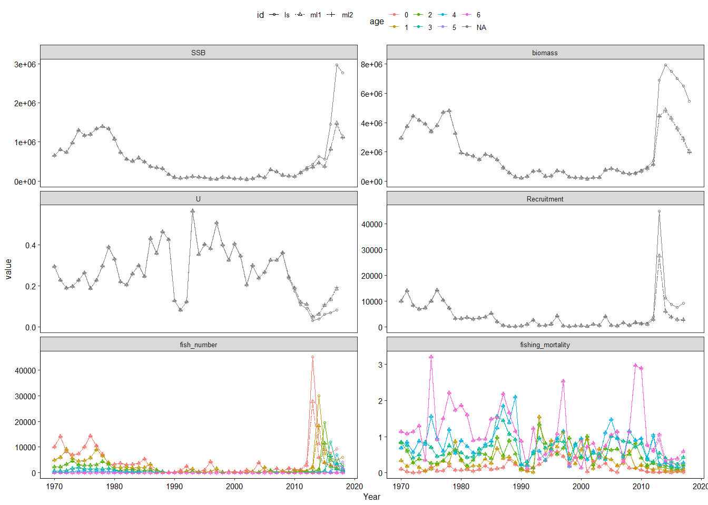

### モデル診断1: 残差プロット

**patchworkパッケージが必要です!!**

    resid3.2 <- plot_residual_vpa(res3.2, plot_year = 2000:2018)

    # 残差の時系列プロット
    resid3.1$year_resid|resid3.2$year_resid

    ## `geom_smooth()` using method = 'loess' and formula 'y ~ x'

    ## Warning: Removed 137 rows containing non-finite values (stat_smooth).

    ## Warning: Removed 137 rows containing missing values (geom_point).

    ## `geom_smooth()` using method = 'loess' and formula 'y ~ x'

    ## Warning: Removed 137 rows containing non-finite values (stat_smooth).

    ## Warning: Removed 137 rows containing missing values (geom_point).

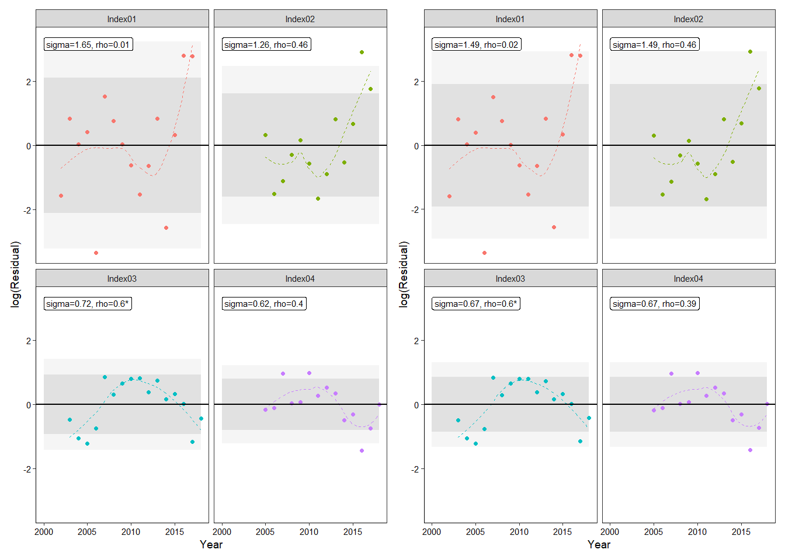

    # 資源量とのフィッティング
    resid3.1$fitting_Index|resid3.2$fitting_Index

    ## Warning: Removed 137 rows containing missing values (geom_point).

    ## Warning: Removed 120 row(s) containing missing values (geom_path).

    ## Warning: Removed 137 rows containing missing values (geom_point).

    ## Warning: Removed 120 row(s) containing missing values (geom_path).

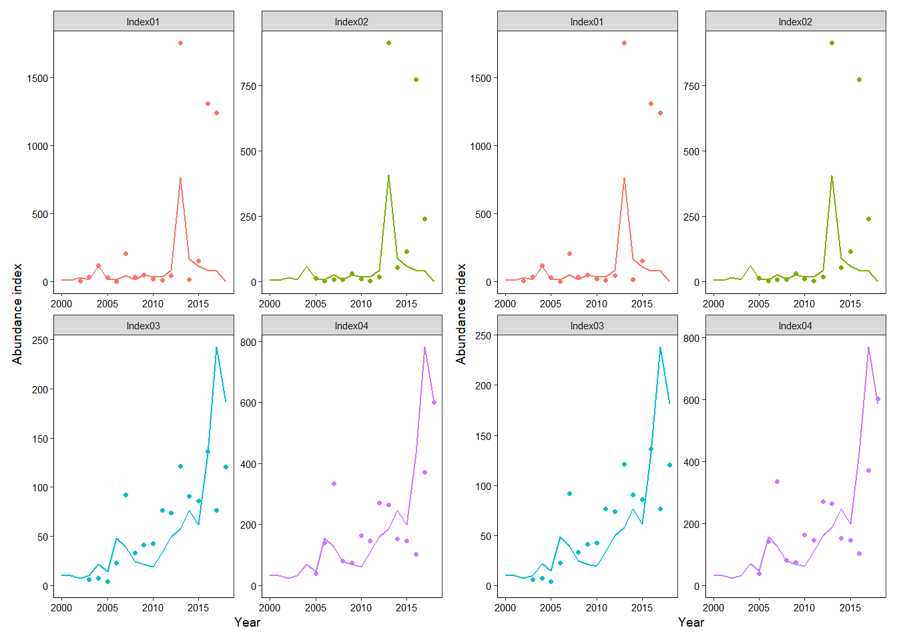

-   それほど大きな違いは見られない
-   重みを共有したことでindex4はより残差が

### モデル診断2: レトロスペクティブ解析

    retro3.2 <- do_retrospective_vpa(res3.2)

    ## Joining, by = "index"

    ## New names:
    ## * value -> value...1
    ## * value -> value...2
    ## * value -> value...3
    ## * value -> value...4
    ## * value -> value...5

    retro3.2$graph

    ## Warning: Removed 6 rows containing missing values (geom_point).

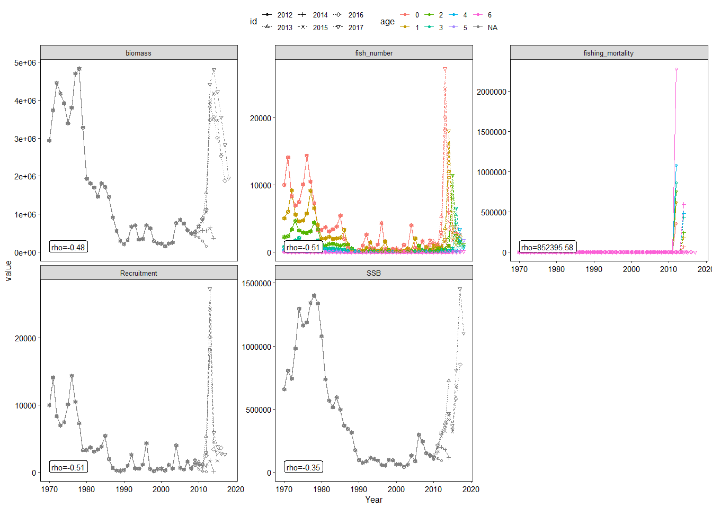

-   やはりFのレトロの結果が収束していない
-   資源量についても過小推定のレトロバイアスが見られる
-   **最小二乗法の方がレトロバイアスが少なく予測能力が高いのか**

### モデル選択

AICという指標を用います。AICが小さい方が予測力のあるモデルと言えます。より小さいAICからの差を取ったものをデルタAICと言い、それをお示しします。

    aic2.1 <- -2*res2.1$logLik+2
    aic3.1 <- -2*res3.1$logLik+2*4
    aic3.2 <- -2*res3.2$logLik+2*2

    data.frame(Model=c(2.1, 3.1, 3.2),
               AIC = c(aic2.1-min(c(aic2.1,aic3.1, aic3.2)),
                       aic3.1-min(c(aic2.1,aic3.1, aic3.2)),
                       aic3.2-min(c(aic2.1,aic3.1, aic3.2))))

    ##   Model      AIC
    ## 1   2.1 8.501430
    ## 2   3.1 2.665548
    ## 3   3.2 0.000000

-   AICでも同様の傾向が見られた
-   観測誤差が等分散、つまり指標値の重みは等しいモデルは良くないことが支持されました

### 観測誤差がデータ間で等分散の最尤推定法(=最小二乗法)

VPA-07動画の宿題の答えです。試してみてください。

    res3.3 <- vpa(dat=dat,
                  tf.year = 2015:2017,
                  plus.group = TRUE,
                  last.catch.zero = TRUE,
                  Pope = TRUE,
                  tune = TRUE,
                  alpha = 1,
                  sel.update = TRUE,
                  est.method = "ml",
                  term.F = "max",
                  abund = c("N","N","SSB","SSB"),
                  min.age = c(0,0,0,0),
                  max.age = c(0,0,6,6),
                  use.index = 1:4,
                  sigma.constraint = c(1,1,1,1), # 最小二乗法の意味です
                  plot = TRUE,
                  plot.year = 2002:2018
                  )

    ## `geom_smooth()` using method = 'loess' and formula 'y ~ x'

    ## Warning: Removed 137 rows containing non-finite values (stat_smooth).

    ## Warning: Removed 137 rows containing missing values (geom_point).

    ## Warning: Removed 137 rows containing missing values (geom_point).

    ## Warning: Removed 128 row(s) containing missing values (geom_path).

    ## Warning: Removed 137 rows containing missing values (geom_point).

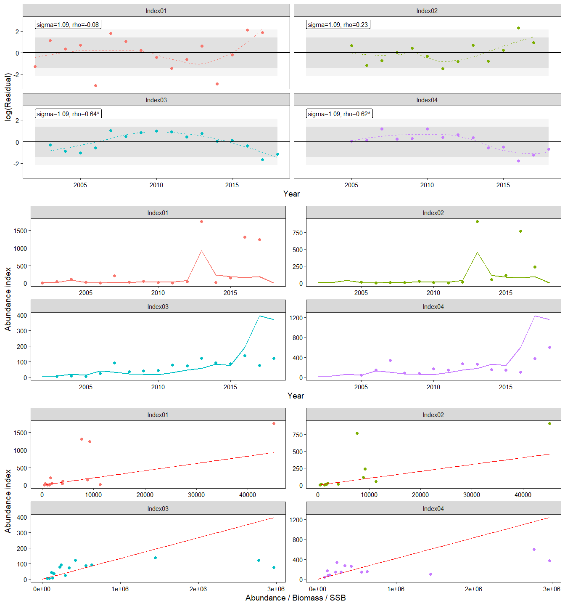

    res3.3$faa[,as.character(2013:2017)]

    ##          2013       2014        2015       2016       2017
    ## 0 0.008065303 0.01524298 0.004641666 0.01613209 0.01228393
    ## 1 0.125696603 0.03364325 0.029520889 0.02978417 0.03440618
    ## 2 0.184260086 0.14295076 0.092203664 0.06117555 0.08833885
    ## 3 0.446079122 0.30146472 0.195882348 0.12543880 0.18495444
    ## 4 0.190327467 0.20854435 0.139675414 0.08444706 0.12888233
    ## 5 0.909479342 0.26088313 0.252274458 0.23518185 0.28240884
    ## 6 0.909479342 0.26088313 0.252274458 0.23518185 0.28240884

    res2.1$faa[,as.character(2013:2017)]

    ##          2013       2014        2015       2016       2017
    ## 0 0.008065303 0.01524298 0.004641667 0.01613209 0.01228393
    ## 1 0.125696604 0.03364325 0.029520889 0.02978417 0.03440618
    ## 2 0.184260087 0.14295076 0.092203665 0.06117555 0.08833886
    ## 3 0.446079125 0.30146472 0.195882351 0.12543881 0.18495444
    ## 4 0.190327469 0.20854436 0.139675416 0.08444706 0.12888234
    ## 5 0.909479347 0.26088313 0.252274461 0.23518186 0.28240884
    ## 6 0.909479347 0.26088313 0.252274461 0.23518186 0.28240884

2-3. bの考慮
------------

-   目を凝らして残差プロットを見てみますと、資源量と資源量指数の線形性に疑問を感じ始めました

*I**t* = *q**B**t**b*

という関係があって、普段は*b* = 1です。

したがって、この関数は比例の直線みたいになっています。

    res4.1 <- vpa(dat=dat,
                  tf.year = 2015:2017,
                  plus.group = TRUE,
                  last.catch.zero = TRUE,
                  Pope = TRUE,
                  tune = TRUE,
                  alpha = 1,
                  sel.update = TRUE,
                  est.method = "ml",
                  term.F = "max",
                  abund = c("N","N","SSB","SSB"),
                  min.age = c(0,0,0,0),
                  max.age = c(0,0,6,6),
                  use.index = 1:4,
                  sigma.constraint = c(1,1,2,2),
                  b.est = TRUE, # bを推定するにはここをTRUEにする
                  plot = TRUE,
                  plot.year = 2002:2018
                  )

    ## `geom_smooth()` using method = 'loess' and formula 'y ~ x'

    ## Warning: Removed 137 rows containing non-finite values (stat_smooth).

    ## Warning: Removed 137 rows containing missing values (geom_point).

    ## Warning: Removed 137 rows containing missing values (geom_point).

    ## Warning: Removed 128 row(s) containing missing values (geom_path).

    ## Warning: Removed 137 rows containing missing values (geom_point).

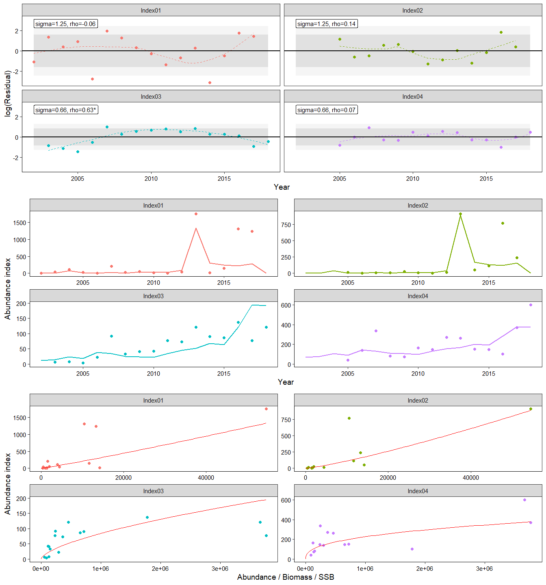

    res4.1$b

    ## [1] 1.0933420 1.2146768 0.6332071 0.3830410

    res4.1$faa[,as.character(2013:2017)]

    ##          2013       2014        2015       2016        2017
    ## 0 0.006664792 0.01209421 0.003519552 0.01169498 0.008476137
    ## 1 0.109550530 0.02769972 0.023313624 0.02248941 0.024768348
    ## 2 0.165820241 0.12232726 0.075050848 0.04784494 0.065721118
    ## 3 0.406930730 0.26397593 0.163261238 0.09996187 0.140616098
    ## 4 0.172527277 0.18410715 0.118704853 0.06867451 0.099953420
    ## 5 0.846752252 0.23099098 0.216134370 0.19384031 0.221257822
    ## 6 0.846752252 0.23099098 0.216134370 0.19384031 0.221257822

    resid4.1 <- plot_residual_vpa(res4.1)
    resid4.1$abund_Index

    ## Warning: Removed 137 rows containing missing values (geom_point).

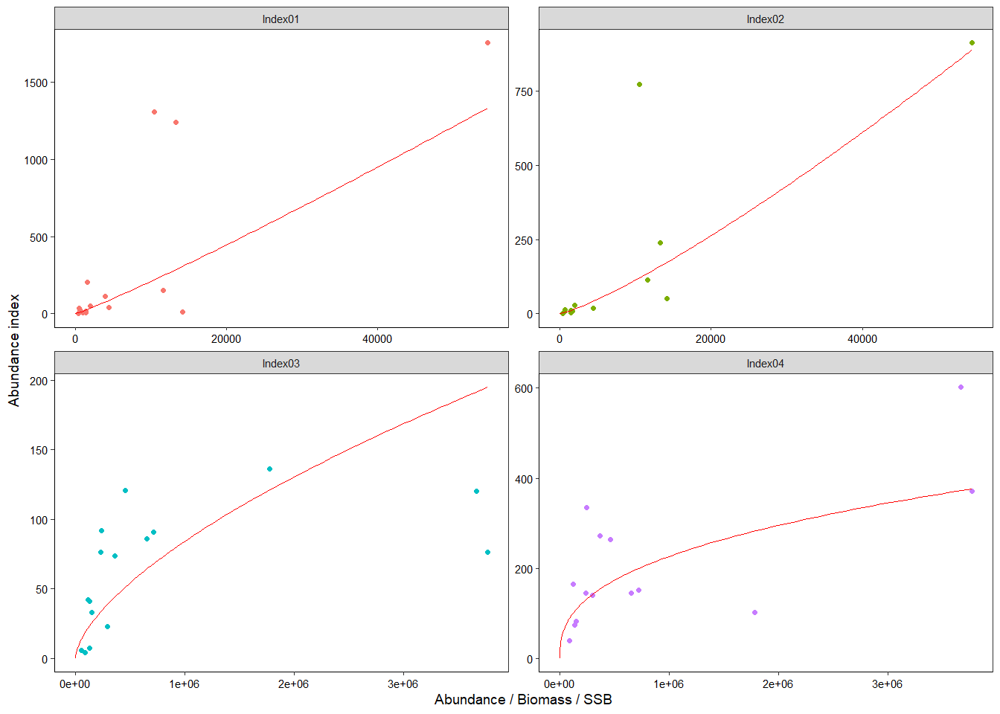

-   親魚の指数のbは1から大きく離れた値が推定されました

-   これはすなわち、実際に海にたくさん親魚がいても、その指数（ここではたもすくいと産卵量）は比例せず、ある程度以上の親魚数になると、これらの指標は頭打ちになるということです

    -   データからもこういった特性が見えてくるのは面白いですね
    -   これらのデータは資源が高位な時期には感度が悪い（逆に低位な時期には感度がいい）とも言いえます
    -   良い悪いではなく!（決してデータそのものを批判するものではありません）

-   年齢別漁獲係数を見てみても、2013年最高齢の極端なFが少し落ち着いた印象を受けます

-   bについても重みのパラメータと同様に、必要な分だけ推定するといったことができます

    -   試しに親魚指数だけb推定をするといったことをしてみましょう
    -   index2については微妙なので、先程と同様にモデル選択で予測力を確認してみましょう

<!-- -->

    # Index1以外のbの推定
    res4.2 <- vpa(dat=dat,
                  tf.year = 2015:2017,
                  plus.group = TRUE,
                  last.catch.zero = TRUE,
                  Pope = TRUE,
                  tune = TRUE,
                  alpha = 1,
                  sel.update = TRUE,
                  est.method = "ml",
                  term.F = "max",
                  abund = c("N","N","SSB","SSB"),
                  min.age = c(0,0,0,0),
                  max.age = c(0,0,6,6),
                  use.index = 1:4,
                  sigma.constraint = c(1,1,2,2),
                  b.est = TRUE,
                  b.fix = c(1,NA,NA,NA),
                  plot = TRUE,
                  plot.year = 2002:2018
                  )

    ## `geom_smooth()` using method = 'loess' and formula 'y ~ x'

    ## Warning: Removed 137 rows containing non-finite values (stat_smooth).

    ## Warning: Removed 137 rows containing missing values (geom_point).

    ## Warning: Removed 137 rows containing missing values (geom_point).

    ## Warning: Removed 128 row(s) containing missing values (geom_path).

    ## Warning: Removed 137 rows containing missing values (geom_point).

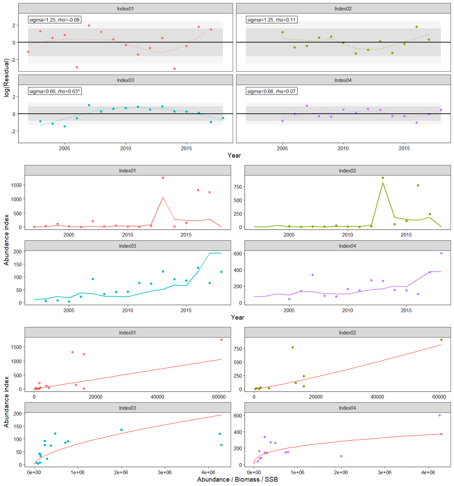

    res4.2$faa[,as.character(2013:2017)]

    ##          2013       2014       2015        2016        2017
    ## 0 0.005984649 0.01064330 0.00303077 0.009858136 0.006982288
    ## 1 0.101080745 0.02482899 0.02047285 0.019330985 0.020817966
    ## 2 0.155660316 0.11180614 0.06690605 0.041830111 0.056134804
    ## 3 0.384934455 0.24418798 0.14726978 0.088236531 0.121421369
    ## 4 0.162608640 0.17103781 0.10811703 0.061215532 0.087154481
    ## 5 0.810528467 0.21493651 0.19767569 0.173913210 0.193907071
    ## 6 0.810528467 0.21493651 0.19767569 0.173913210 0.193907071

    # 親魚指数のみb推定
    res4.3 <- vpa(dat=dat,
                  tf.year = 2015:2017,
                  plus.group = TRUE,
                  last.catch.zero = TRUE,
                  Pope = TRUE,
                  tune = TRUE,
                  alpha = 1,
                  sel.update = TRUE,
                  est.method = "ml",
                  term.F = "max",
                  abund = c("N","N","SSB","SSB"),
                  min.age = c(0,0,0,0),
                  max.age = c(0,0,6,6),
                  use.index = 1:4,
                  sigma.constraint = c(1,1,2,2),
                  b.est = TRUE,
                  b.fix = c(1,1,NA,NA),
                  plot = TRUE,
                  plot.year = 2002:2018
                  )

    ## `geom_smooth()` using method = 'loess' and formula 'y ~ x'

    ## Warning: Removed 137 rows containing non-finite values (stat_smooth).

    ## Warning: Removed 137 rows containing missing values (geom_point).

    ## Warning: Removed 137 rows containing missing values (geom_point).

    ## Warning: Removed 128 row(s) containing missing values (geom_path).

    ## Warning: Removed 137 rows containing missing values (geom_point).

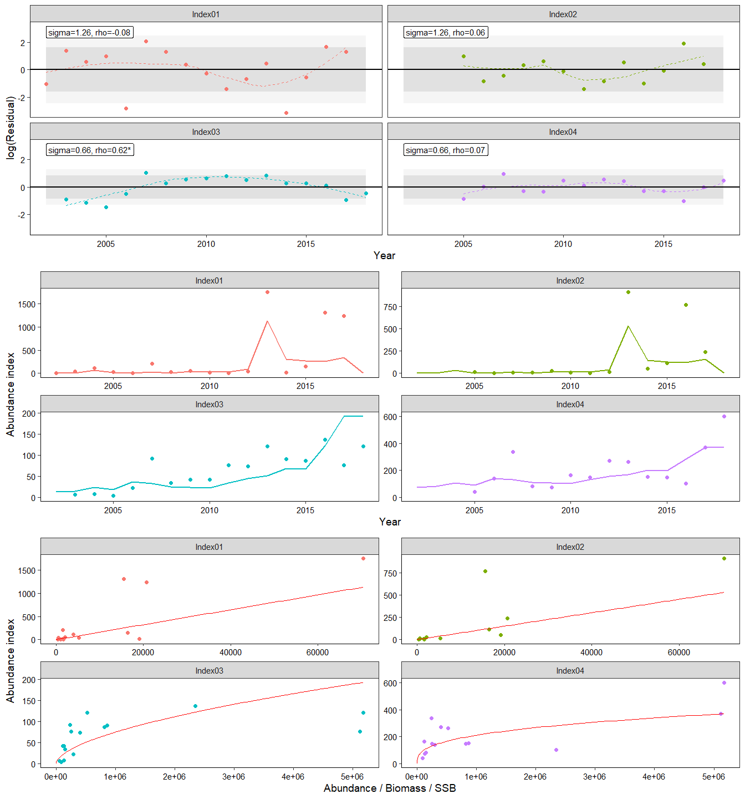

    res4.3$faa[,as.character(2013:2017)]

    ##          2013        2014        2015        2016        2017
    ## 0 0.005159154 0.008950261 0.002482878 0.007872148 0.005426028
    ## 1 0.090175803 0.021358396 0.017173353 0.015804242 0.016572414
    ## 2 0.142048900 0.098549241 0.057177858 0.034910343 0.045573234
    ## 3 0.354967580 0.218579101 0.127709103 0.074531700 0.099923076
    ## 4 0.149194692 0.153948727 0.094880651 0.052325431 0.072584567
    ## 5 0.759962661 0.193871025 0.174392027 0.149832204 0.162510250
    ## 6 0.759962661 0.193871025 0.174392027 0.149832204 0.162510250

    # bの値の比較
    data.frame(Model = c(4.1, 4.2, 4.3),
               index1 = c(res4.1$b[1], res4.2$b[1], res4.3$b[1]),
               index2 = c(res4.1$b[2], res4.2$b[2], res4.3$b[2]),
               index3 = c(res4.1$b[3], res4.2$b[3], res4.3$b[3]),
               index4 = c(res4.1$b[4], res4.2$b[4], res4.3$b[4])
               )

    ##   Model   index1   index2    index3    index4
    ## 1   4.1 1.093342 1.214677 0.6332071 0.3830410
    ## 2   4.2 1.000000 1.171236 0.6071658 0.3651358
    ## 3   4.3 1.000000 1.000000 0.5756483 0.3433965

    aic3.2 <- -2*res3.2$logLik
    aic4.1 <- -2*res4.1$logLik+2*4  # 4つののbを推定しました
    aic4.2 <- -2*res4.2$logLik+2*3  # Index1を除く3つのbを推定しました
    aic4.3 <- -2*res4.3$logLik+2*2  # Index1と2を除く2つのbを推定しました

    data.frame(Model=c(3.2, 4.1, 4.2, 4.3),
               deltaAIC = c(aic3.2-min(c(aic3.2, aic4.1, aic4.2, aic4.3)),
                            aic4.1-min(c(aic3.2, aic4.1, aic4.2, aic4.3)),
                            aic4.2-min(c(aic3.2, aic4.1, aic4.2, aic4.3)),
                            aic4.3-min(c(aic3.2, aic4.1, aic4.2, aic4.3))))

    ##   Model deltaAIC
    ## 1   3.2 6.791824
    ## 2   4.1 3.505836
    ## 3   4.2 1.608488
    ## 4   4.3 0.000000

**bはIndex1以外で推定するモデルが、一番予測能力があるという結果になりました**

**モデル診断も忘れてはいけません!!**

### モデル診断1: 残差プロット

    resid4.3 <- plot_residual_vpa(res4.3, plot_year = 2000:2018)

    # 残差の時系列プロット
    resid4.3$year_resid+ggtitle("res4.3") | resid3.2$year_resid+ggtitle("res3.2")

    ## `geom_smooth()` using method = 'loess' and formula 'y ~ x'

    ## Warning: Removed 137 rows containing non-finite values (stat_smooth).

    ## Warning: Removed 137 rows containing missing values (geom_point).

    ## `geom_smooth()` using method = 'loess' and formula 'y ~ x'

    ## Warning: Removed 137 rows containing non-finite values (stat_smooth).

    ## Warning: Removed 137 rows containing missing values (geom_point).

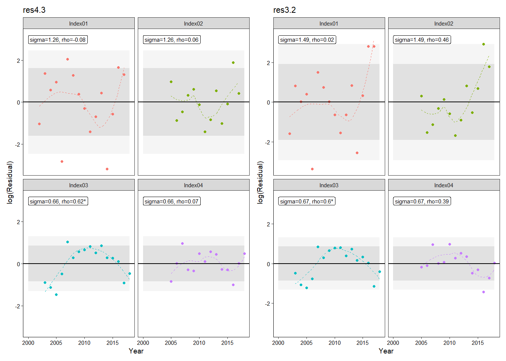

    # 資源量とのフィッティング
    resid4.3$fitting_Index+ggtitle("res4.3") | resid3.2$fitting_Index+ggtitle("res3.2")

    ## Warning: Removed 137 rows containing missing values (geom_point).

    ## Warning: Removed 120 row(s) containing missing values (geom_path).

    ## Warning: Removed 137 rows containing missing values (geom_point).

    ## Warning: Removed 120 row(s) containing missing values (geom_path).

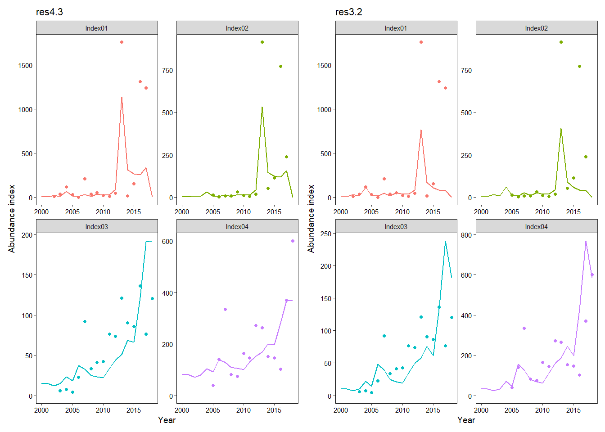

    # 資源量と資源量指数の関係
    resid4.3$abund_Index+ggtitle("res4.3") | resid3.2$abund_Index+ggtitle("res3.2")

    ## Warning: Removed 137 rows containing missing values (geom_point).

    ## Warning: Removed 137 rows containing missing values (geom_point).

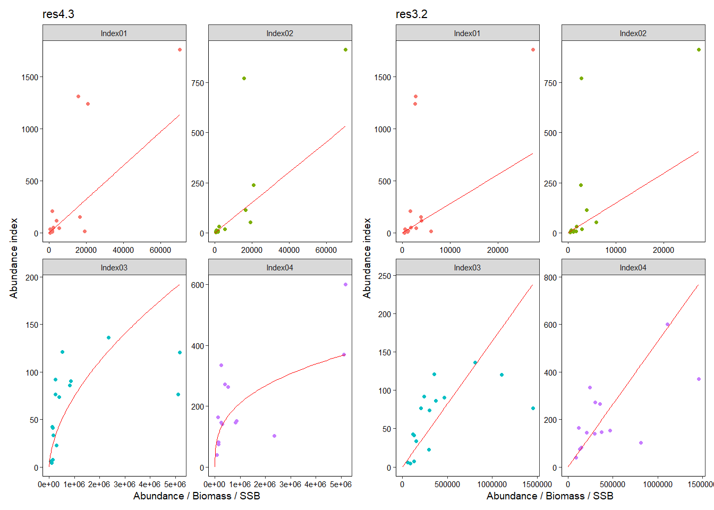

### モデル診断2: レトロスペクティブ解析

    retro4.3 <- do_retrospective_vpa(res4.3)

    ## Joining, by = "index"

    ## New names:
    ## * value -> value...1
    ## * value -> value...2
    ## * value -> value...3
    ## * value -> value...4
    ## * value -> value...5

    retro4.3$graph

    ## Warning: Removed 6 rows containing missing values (geom_point).

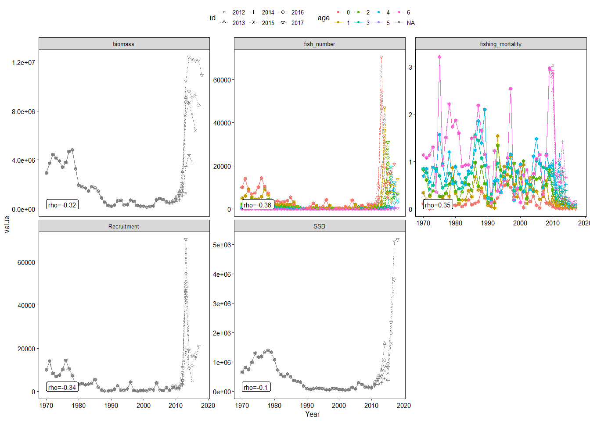

-   まだバイオマスに過小推定のレトロバイアスが見られる
-   前のモデルよりMohn’s rhoは小さくなってきている

ggplot小話
----------

    retro4.3$graph+xlim(2005,2018)

    ## Warning: Removed 1680 row(s) containing missing values (geom_path).

    ## Warning: Removed 3576 rows containing missing values (geom_point).

    ## Warning: Removed 5 rows containing missing values (geom_label).

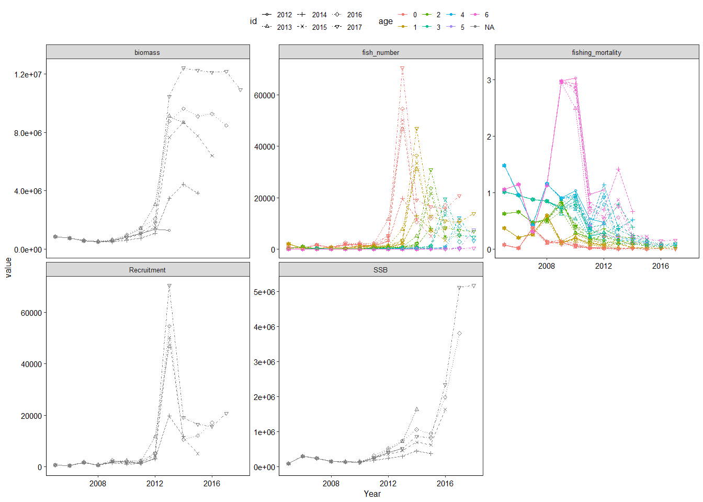

    retro4.3$graph+xlim(2005,2018)+ggtitle("モデル4.3のレトロ解析")

    ## Warning: Removed 1680 row(s) containing missing values (geom_path).

    ## Warning: Removed 3576 rows containing missing values (geom_point).

    ## Warning: Removed 5 rows containing missing values (geom_label).

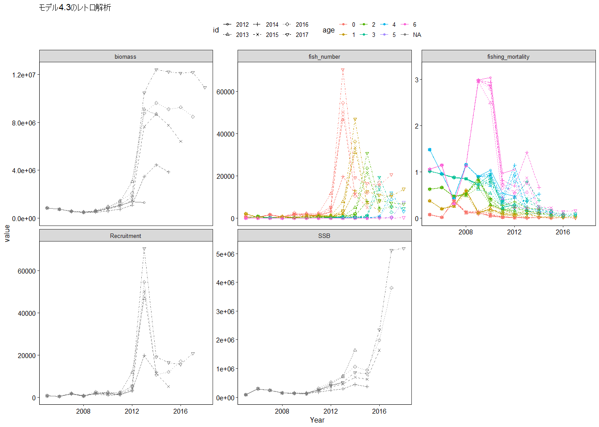

2-4. 全F推定法
--------------

    res5.1 <- vpa(dat,
                  tf.year = 2015:2017,
                tune = TRUE,
                term.F = "all",
                alpha = 1,
                abund = c("N","N","SSB","SSB"),
                min.age = c(0,0,0,0),
                max.age = c(0,0,6,6),
                est.method="ml", #重み推定（最尤法）
                b.est = TRUE, #b推定
                sel.def="max",
                #b.fix = c(1,1,NA,NA),
                last.catch.zero=TRUE,
                fc.year=2016:2018,
                plot = TRUE,
                plot.year = 2002:2018,
                use.index =1:4,
                sigma.constraint = c(1,1,2,2)
    )

    ## `geom_smooth()` using method = 'loess' and formula 'y ~ x'

    ## Warning: Removed 137 rows containing non-finite values (stat_smooth).

    ## Warning: Removed 137 rows containing missing values (geom_point).

    ## Warning: Removed 137 rows containing missing values (geom_point).

    ## Warning: Removed 128 row(s) containing missing values (geom_path).

    ## Warning: Removed 137 rows containing missing values (geom_point).

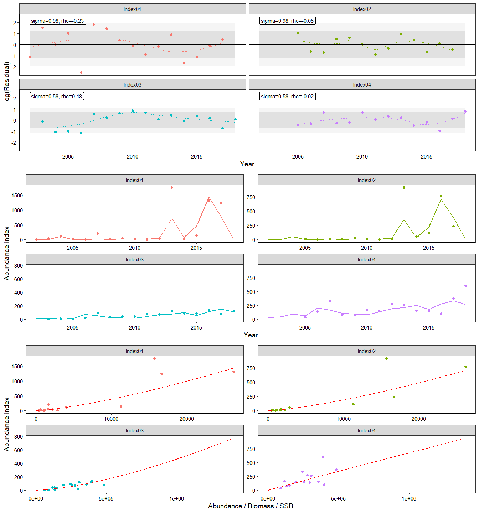

    res5.1$faa[,as.character(2013:2017)]

    ##        2013       2014        2015        2016         2017
    ## 0 0.0233673 0.06180418 0.003626864 0.004680797 6.758223e-03
    ## 1 0.2347387 0.10157883 0.128676848 0.023184386 9.805120e-03
    ## 2 0.2837677 0.30533928 0.321907833 0.317435997 6.784699e-02
    ## 3 0.6422689 0.54832694 0.533344175 0.622710344 1.615977e+02
    ## 4 0.2820997 0.35898353 0.315539287 0.306116236 1.521987e+00
    ## 5 1.1955841 0.44157438 0.536604017 0.731234576 1.242000e+01
    ## 6 1.1955841 0.44157438 0.536604017 0.731234576 1.242000e+01

-   残差プロットの自己相関係数の有意\*がなくなり一見よく見える
-   けれども**Fの値は発散**している
-   これは最終年のFを自由に動かして**データにオーバーフィット**してしまった
-   先述の通り、VPAは最終年のFでしか個体群動態の挙動を動かすことができないから
-   特にこのデータでは最近年のFが増加傾向にあるので、Fの推定も発散気味になってしまう
-   このFの収束と資源量指標値のフィットを改善したものが**リッジVPA**と呼ばれる手法

<!-- -->

    res5.2 <- vpa(dat,
                  tf.year = 2015:2017,
                tune = TRUE,
                term.F = "all",
                alpha = 1,
                abund = c("N","N","SSB","SSB"),
                min.age = c(0,0,0,0),
                max.age = c(0,0,6,6),
                est.method="ml", #重み推定（最尤法）
                b.est = TRUE, #b推定
                sel.def="max",
                p.init = res4.3$faa[,"2017"],
                last.catch.zero=TRUE,
                fc.year=2016:2018,
                plot = TRUE,
                plot.year = 2002:2018,
                use.index =1:4,
                sigma.constraint = c(1,1,2,2)
    )

    ## `geom_smooth()` using method = 'loess' and formula 'y ~ x'

    ## Warning: Removed 137 rows containing non-finite values (stat_smooth).

    ## Warning: Removed 137 rows containing missing values (geom_point).

    ## Warning: Removed 137 rows containing missing values (geom_point).

    ## Warning: Removed 128 row(s) containing missing values (geom_path).

    ## Warning: Removed 137 rows containing missing values (geom_point).

    res5.2$faa[,as.character(2013:2017)]

    ##         2013       2014        2015       2016         2017
    ## 0 0.02336739 0.06180417 0.003626831 0.00468078  0.006758206
    ## 1 0.23473893 0.10157924 0.128676840 0.02318417  0.009805086
    ## 2 0.28376790 0.30533973 0.321909437 0.31743597  0.067846322
    ## 3 0.64226932 0.54832753 0.533345385 0.62271538 16.172214955
    ## 4 0.28209990 0.35898386 0.315539805 0.30611728  1.522025773
    ## 5 1.19558458 0.44157477 0.536604811 0.73123664 16.601352492
    ## 6 1.19558458 0.44157477 0.536604811 0.73123664 16.601352492

Index3を取り除いてみる
----------------------

結局、Index3の自己相関係数は有意なままでした。
ただモデル診断というのは**明確な良し悪しの線引きを示すものではありません。**
もちろん、自己相関係数が有意だからこの結果は信用できないという人もいるかもしれませんが、
また異なるモデル診断を通して、Index3はそれほど影響が大きくないんだということを示すことも一つの手です。

あとでジャックナイフ法でもやりますが、試しにIndex3を抜いてみましょう
こうすることで、残差に自己相関のないデータだけで資源評価を行ったという、妥当性を示すことができます。

    res6.1 <- vpa(dat=dat,
                  tf.year = 2015:2017,
                  plus.group = TRUE,
                  last.catch.zero = TRUE,
                  Pope = TRUE,
                  tune = TRUE,
                  alpha = 1,
                  sel.update = TRUE,
                  est.method = "ml",
                  term.F = "max",
                  abund = c("N","N","SSB","SSB"),
                  min.age = c(0,0,0,0),
                  max.age = c(0,0,6,6),
                  use.index = c(1,2,4),
                  sigma.constraint = c(1,1,2,2),
                  b.est = TRUE,
                  b.fix = c(1,NA,NA),
                  p.init = res4.3$term.f,
                  plot = TRUE,
                  plot.year = 2002:2018
                  )

    ## `geom_smooth()` using method = 'loess' and formula 'y ~ x'

    ## Warning: Removed 104 rows containing non-finite values (stat_smooth).

    ## Warning: Removed 104 rows containing missing values (geom_point).

    ## Warning: Removed 104 rows containing missing values (geom_point).

    ## Warning: Removed 96 row(s) containing missing values (geom_path).

    ## Warning: Removed 104 rows containing missing values (geom_point).

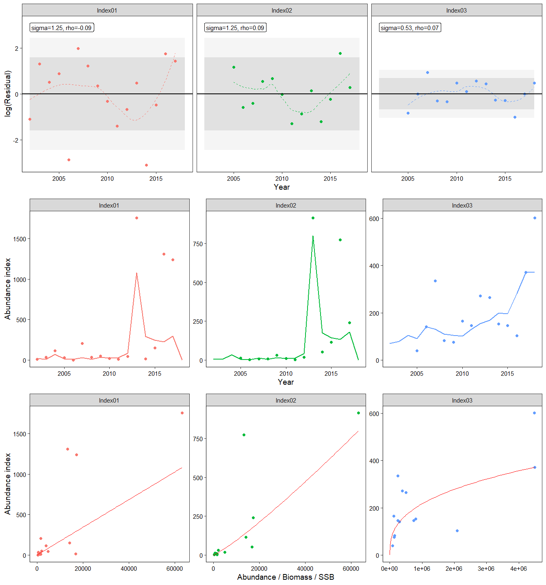

    plot_vpa(list(res4.3=res4.3, res6.1=res6.1),
             what.plot = c("SSB", "biomass", "U", "Recruitment",
                           "fish_number", "fishing_mortality"))

    ## Warning: Removed 2 rows containing missing values (geom_point).

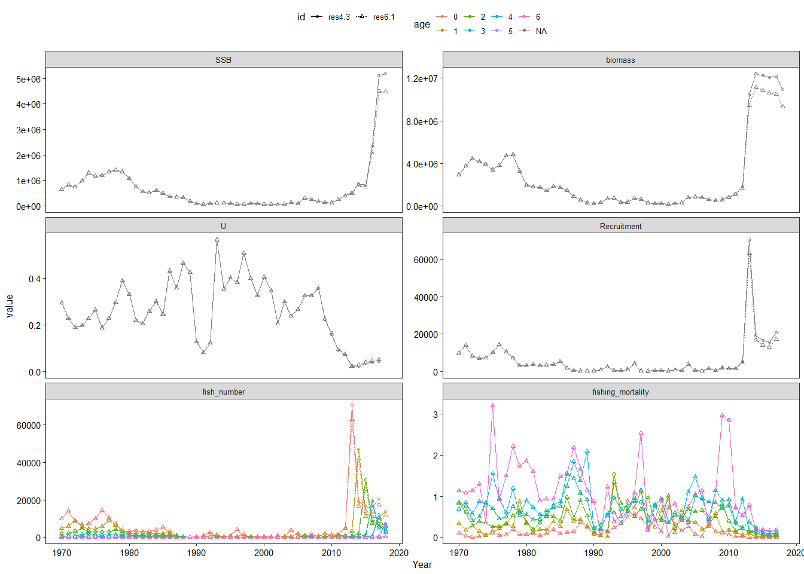

残差プロットやCPUEへのフィッティングを見る限り、決して悪くはありません。
自己相関係数そのもの値も低く、フィットはいいかと思います。 。

### モデル診断2: レトロスペクティブ解析

    retro6.1 <- do_retrospective_vpa(res6.1)

    ## Joining, by = "index"

    ## New names:
    ## * value -> value...1
    ## * value -> value...2
    ## * value -> value...3
    ## * value -> value...4
    ## * value -> value...5

    retro6.1$graph

    ## Warning: Removed 6 rows containing missing values (geom_point).

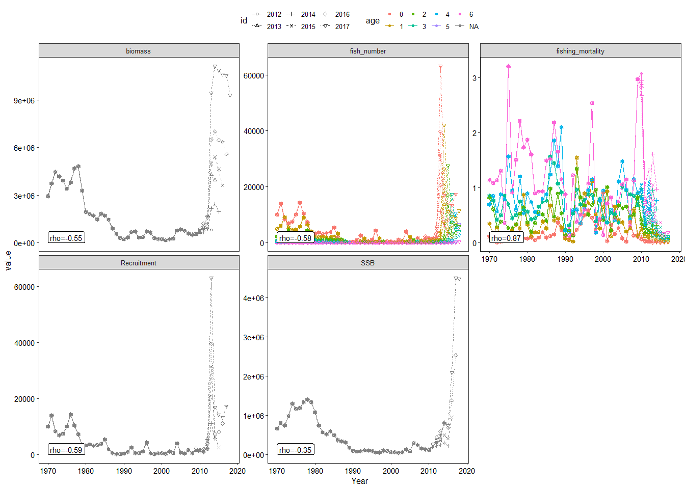

Mohnのrhoを見て頂いても明確ですが、Index3を抜くことで決してレトロバイアスが減るわけではありません。
推定精度が良くなるわけでもないですし、データを抜くというのは恣意的な作業の一つでもあります。
（データが不完全、あるいは標準化されていない等でない限り）
したがって、これまで通り4本の資源量指標値の結果を用いて、今後のモデル診断も進めていきたいと思います。

3. VPA計算結果まとめ
====================

    plot_vpa(list(non_tVPA = res1.1, tVPA_ls = res2.1, tVPA_ml = res3.2, tVPA_ml_b = res4.3), 
             what.plot = c("SSB", "biomass", "U", "Recruitment",
                           "fish_number", "fishing_mortality"))

    ## Warning: Removed 4 rows containing missing values (geom_point).

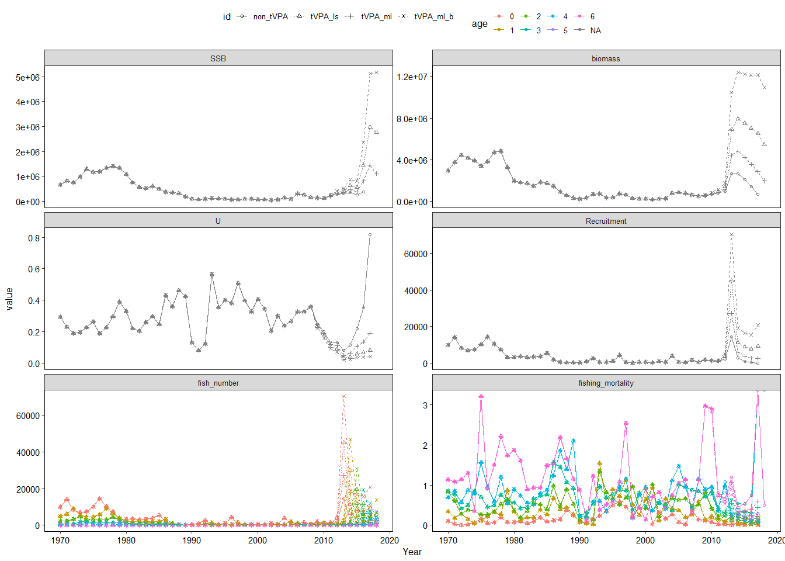

この後、詳細なモデル診断を進めていきますが、その前に一つベースモデルを決めておきたいと思います。

ここまでの流れに従って、ここでは`res4.3`をベースモデルとしてその妥当性をより評価していきたいと思います。

**`res4.3`**

-   チューニング : 資源量指標値4つ
-   ターミナルF : 最終年最高齢F
-   選択率更新法 : あり
-   最適化手法 : 最尤推定法
-   観測誤差 : Index1&2, Index3&4で2つ推定
-   b : Index3、4について推定

4. VPAのモデル診断
==================

先程、ベースモデルと定めた`res4.3`に対してモデル診断を行っていきます。

ここで紹介するモデル診断手法は6つです

-   1.  残差プロット(済)

-   1.  レトロスペクティブ解析(済)

-   1.  ジッター解析

-   1.  感度分析

-   1.  ジャックナイフ法

-   1.  ブートストラップ法

既に残差プロットとレトロスペクティブ解析については見てきたので、3番目のジッター解析からより詳細にモデルの妥当性を検討していきたいと思います

4-3. ジッター解析
-----------------

    res_jitter <- do_estcheck_vpa(res4.3, n_ite=10)

    ## In your VPA result, Hessian successfully having positive definite!!

    ## In your VPA result, Successful convergence!!

    ## Iteration 1 has done ...

    ## Iteration 2 has done ...

    ## Iteration 3 has done ...

    ## Iteration 4 has done ...

    ## Iteration 5 has done ...

    ## Iteration 6 has done ...

    ## Iteration 7 has done ...

    ## Iteration 8 has done ...

    ## Iteration 9 has done ...

    ## Iteration 10 has done ...

    ## Hessian successfully having positive definite for all iterations !!

    ## Successful convergence for all iterations !!

    ## Maximum likelihood in jitter analysis is:  -63.88151 
    ## Likelihood with estimated parameters is:  -78.02624

    res_jitter$graph$likelihood+geom_vline(aes(xintercept=res4.3$input$p.init), linetype=2)

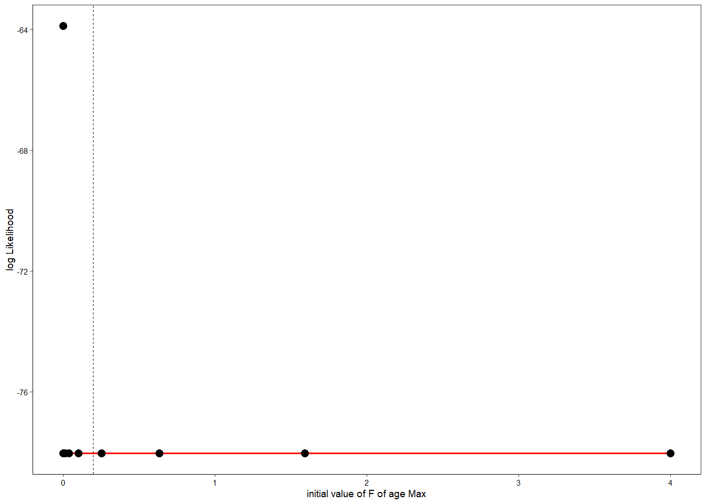

    res_jitter$graph$estimated

    ## Warning: Removed 1 rows containing missing values (geom_point).

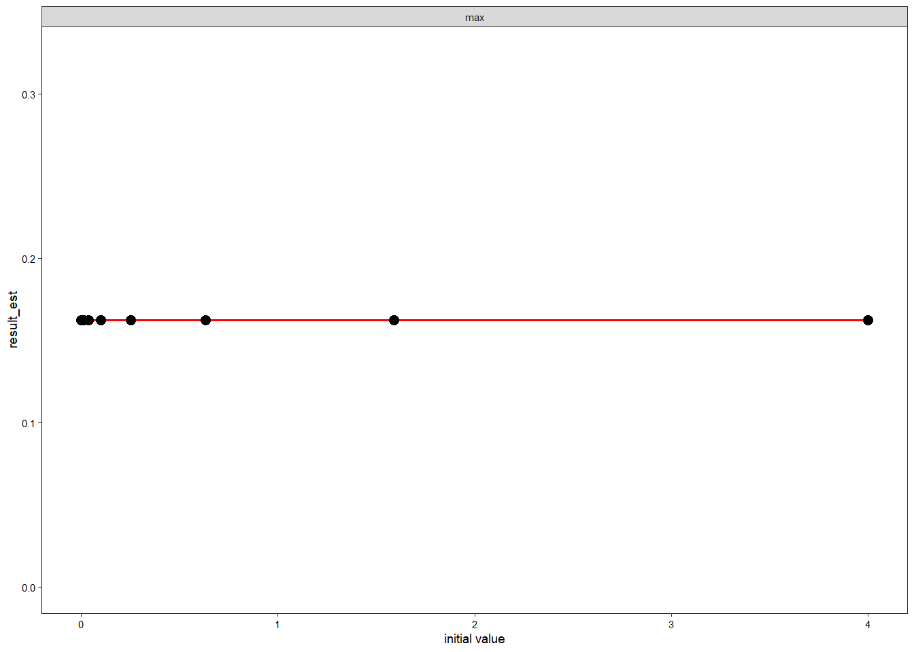

    res_jitter$graph$estimated+ylim(0,NA)

    ## Scale for 'y' is already present. Adding another scale for 'y', which will
    ## replace the existing scale.

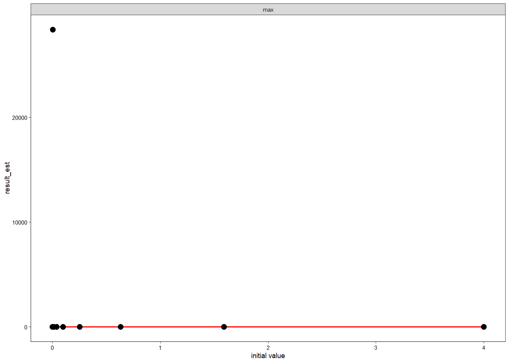

4-4. 感度分析
-------------

-   VPAで仮定している様々な仮定に対して、値を変えた場合に資源推定結果などにどのような影響を与えるか確認します
-   どの値を感度分析の対象にするかで、関数中の引数が変わります
-   どの値を対象にするかは資源によって変わります

### 成熟率

-   `sensitive.maa1`:
    2016-2018年までの成熟率が2015年の成熟率と同じという仮定
-   `sensitive.maa2`:
    2015-2018年までの成熟率が2014年の成熟率と同じという仮定

以上の2通りについて感度分析してみます

    sensitive.maa1 <- sensitive.maa2 <- dat$maa
    sensitive.maa1[4, 47:49] <- 1
    sensitive.maa2[, 46:49] <- dat$maa[,45]

    res_sensitivity <- do_sensitivity_vpa(res4.3, what_replace = "maa", 
                                          value =list(sensitive.maa1,
                                                      sensitive.maa2),                                          what_plot=c("SSB","biomass","U","Recruitment",
                                          "fish_number","fishing_mortality"), 
                                              ncol=3
                                              )
    res_sensitivity$graph

    ## Warning: Removed 3 rows containing missing values (geom_point).

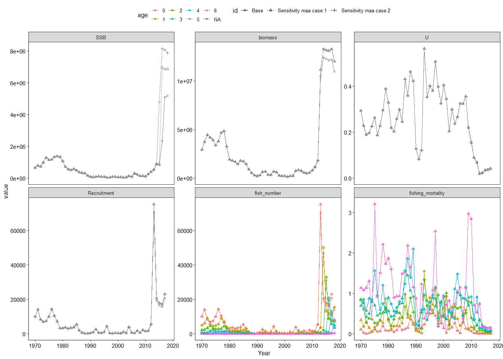

最近年の成熟率がSSBに与える影響が大きいのはある意味想定内です
加入やバイオマス全体の動態が大きく変動していないので、この生物学的パラメータに対してある程度頑健であると言えます

4-5. ジャックナイフ法
---------------------

データ（資源量指標値）を1本ずつ取り除いて推定結果がどれだけ変動するか見る診断手法です。
これによってデータの影響力や外れ値が資源量推定結果に与える影響を見ることができます

    res_jackknife <- do_jackknife_vpa(res4.3,
                                      what_plot=c("SSB","biomass","U","Recruitment",
                                                  "fish_number","fishing_mortality"),
                                      ncol = 3,
                                      plot_year = 2000:2018)
    res_jackknife$JKplot_vpa

    ## Warning: Removed 1200 row(s) containing missing values (geom_path).

    ## Warning: Removed 2705 rows containing missing values (geom_point).

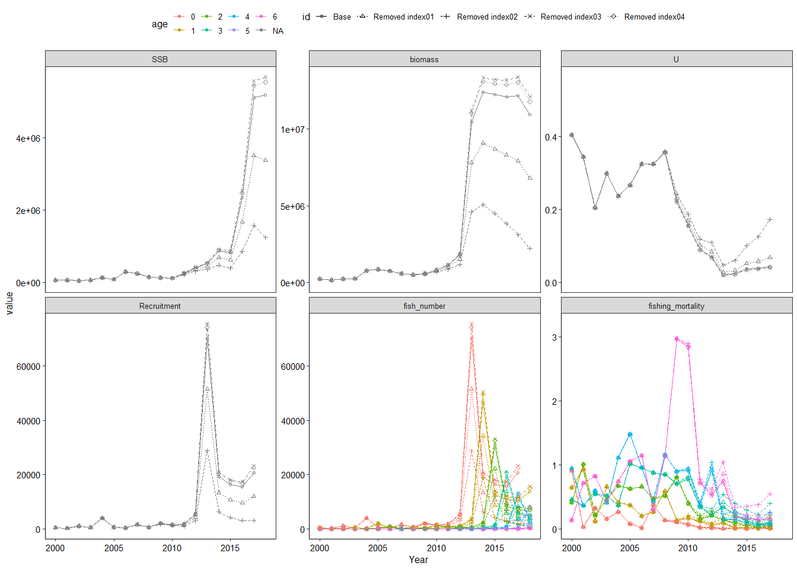

    res_jackknife$JKplot_par

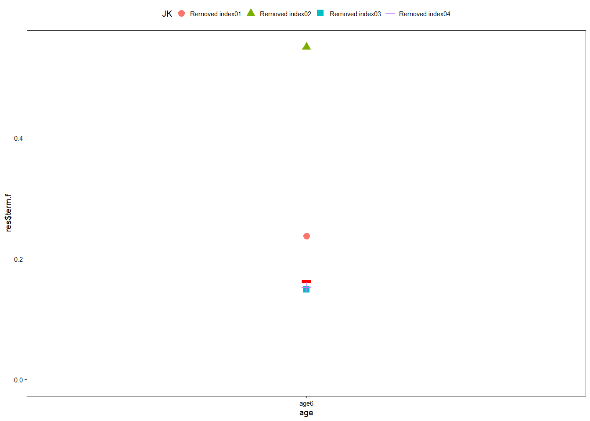

Index2がないと加入量や資源量が大きく推定されることが分かります。
その次にIndex1はの影響が大きく見えます。
いずれも加入の指標ですが、これは2013年の大きな値へフィットしにくくなる、2013年の加入尾数が低く推定される。結果として最近年の資源尾数が低くなるというこ戸田と考えます

    ## Warning: Removed 137 rows containing missing values (geom_point).

    ## Warning: Removed 120 row(s) containing missing values (geom_path).

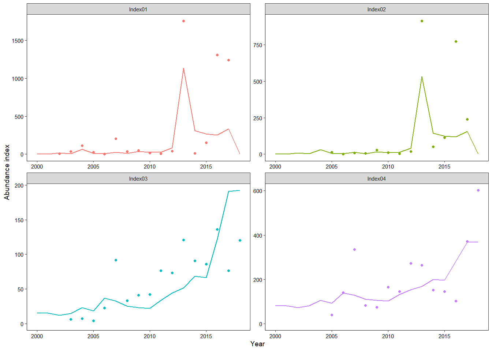

さて、Index3を除いた(×印)場合の結果についてです。このデータは残差の自己相関係数が有意でモデルの妥当性について疑問が残っていたところかと思います。
さきほどの`res6.1`では、実際に取り除いて確認しましたが、ここでも同じことをしています。そしてこのデータを抜いても資源量推定の傾向などに大きな違いがないことがなく、その影響力は限定的だということが分かります。
このデータの影響力が大きく、かつその残差に自己相関係数が有意に大きいという場合は、このデータの妥当性について検証する必要がありますが、そうでない以上このデータを使っても問題はないと考えます。

4-6. ブートストラップ法
-----------------------

    res_boot <- plot_resboot_vpa(res4.3, B_ite = 100)

100回繰り返し計算するので結構時間がかかります。

    ## Registered S3 method overwritten by 'GGally':
    ##   method from   
    ##   +.gg   ggplot2

### 信頼区間の計算

100回分のVPA計算があるので、ここから信頼区間を計算することができます。
信頼区間のプロットは以下のようにすると資源量やSSB、加入量ごとにできるのですが、ここではpatchworkパッケージを使って、まとめてプロットしてみます。

    # とりあえずプロット
    (res_boot$plot_ssb+ggtitle("SSB")) /
      (res_boot$plot_rec+ggtitle("加入量")) /
      (res_boot$plot_biomass+ggtitle("資源量"))

    ## Warning: Removed 1 row(s) containing missing values (geom_path).

    ## Warning: Removed 1 row(s) containing missing values (geom_path).

    ## Warning: Removed 1 row(s) containing missing values (geom_path).

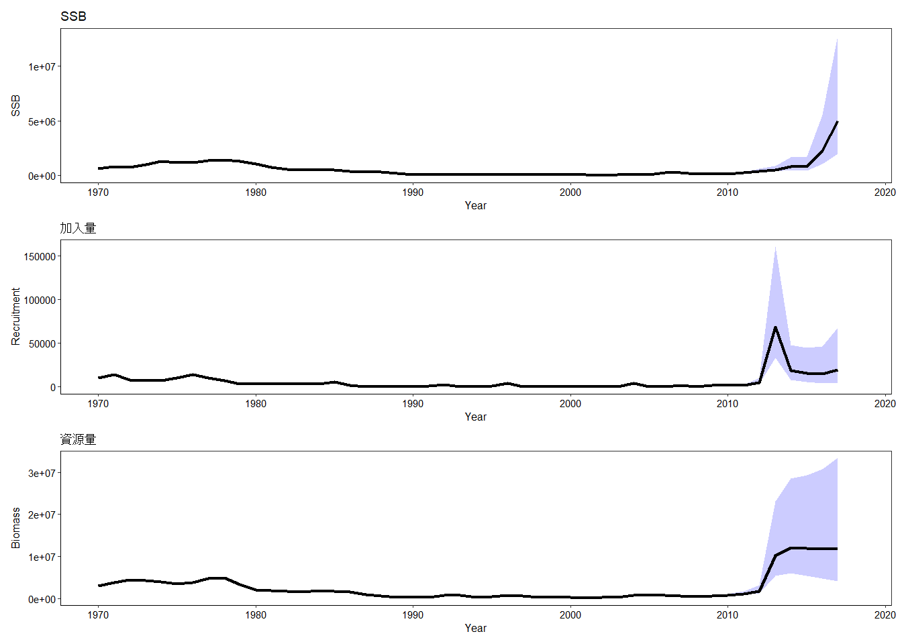

    # 2000年以降でプロット
    (res_boot$plot_ssb+ggtitle("SSB")+xlim(2010,2018)) /
      (res_boot$plot_rec+ggtitle("加入量")+xlim(2010,2018)) /
      (res_boot$plot_biomass+ggtitle("資源量")+xlim(2010,2018))

    ## Warning: Removed 41 row(s) containing missing values (geom_path).

    ## Warning: Removed 41 row(s) containing missing values (geom_path).

    ## Warning: Removed 41 row(s) containing missing values (geom_path).

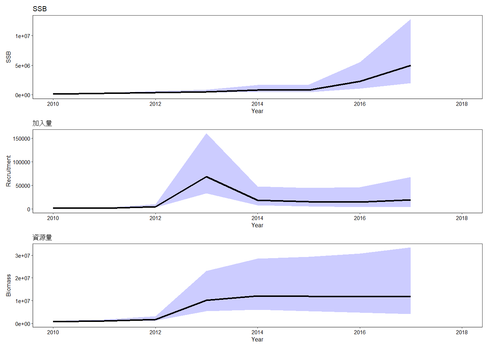

#### VPAで考えられる不確実性の限界

これまでにVPAは最終年のFでしか資源量推定結果をコントロールできないと話してきたかと思います。これは最終年のFが求まると、そこから遡って計算される過去の資源量はモデルの式通りに計算され、10年もすれば資源量指標値によるチューニングの効果もほとんどなくなってしまいます。

最近年の資源量推定結果がFの推定法や最適化手法で大きく異なると議論をしてきましたが、これらは十分に信頼区間の範囲の中です。それだけ**最近年のこの資源の推定結果は不確実さが高いことをこれまでの解析でも感じてきましたし、なによりこのブートストラップ法というモデル診断が示している**ことになります。

#### 過去の不確実性は決して小さくない

そしてもう一つ、過去の信頼区間が非常に狭いですが、これは過去の推定精度が高いことを意味しているわけではありません。VPAというモデルの仮定の基ではこうなる他ないだけです。特に、海外の資源評価などでは今年の資源量と去年の資源量との変動に、確率的な誤差（過程誤差と言います）を加えていたり、あるいは年齢別漁獲尾数についても誤差を考えていたりします。

**これらのデータに不確実性がないとしたモデル**があくまで**VPA**ですが、現実にはこのような誤差はあるものです。

例として、台風の進路予報を上げたいと思います。台風の進路予報は台風の進路上の気圧配置、偏西風の強さや角度など、いろんな値を基に進路の予報円という形で、中心線とともに不確実さを知らせてくれるツールです。ただ時折、予報円を逸れてくる台風もあります。これは例えば台風予測で考えていないデータやその不確実性が引き起こしたもの（例、海面水温、発生したときの環境の測定誤差とか）が原因で、予期せぬ進路を取ったとします。
これをVPAについて置き換えると以下のようになります。

-   考えたデータの不確実性：資源量指標値（台風の例だと気圧配置）
-   考えていないデータとその不確実性：年齢別漁獲尾数、年齢別体重、等々（台風の例だと海面水温）

もちろん実際の台風の予測では海面水温等も使っているはずですが、イメージしやすいあくまで例です。

この台風の例で伝えたかったことは、**VPAの過去の資源量が本当にこの通りかは分からない**ということです。**考えていないデータの不確実性**によって、推定や予測というのは十分に変わりうることを分かって頂けますと幸いです。

### パラメータ間の相関

    res_boot$plot_cor

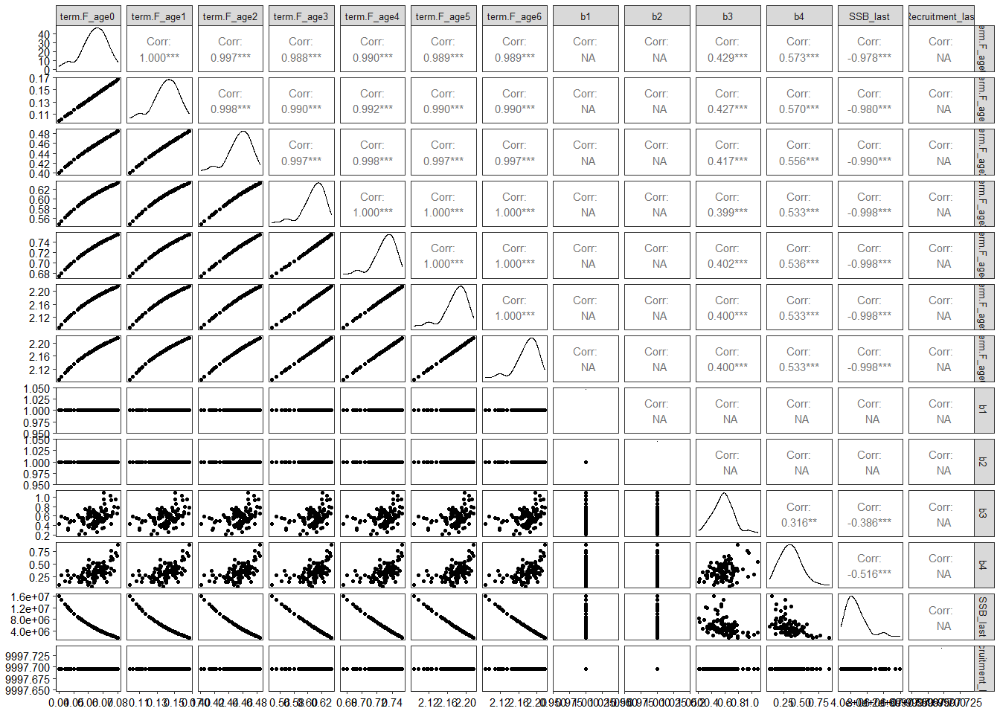

まず最終年のFは各年齢間で強い相関があることが分かります。これは選択率更新法では最終年最高齢のFしか推定していないので、その後はVPA計算の中でFが一意に決まっていることからも、想定通りです。

あとはIndex1の非線形のパラメータであるb1は、推定しないので必ず1になることから、こういった感じになっています

この資源量-資源量指数の非線形性を表すbというパラメータは推定が安定しないことでも有名ですが、b同士では相関が少なく今回は安定して推定できてることが分かるかと思います。

推定最終年のSSBはもちろん最終年のFの推定値と強い相関がありますが、これはVPAの計算上こうなるものです。
一方、bについてはb2を除いては相関しているわけではないことも確認されました。

資料・参考文献
==============

-   令和2年度(2020年度)資源管理研修
    -   [VPA-01: frasyrを用いたVPA
        概要編](https://www.youtube.com/watch?v=RSPX-SVMYog)
    -   [VPA-02: frasyrを用いたVPA
        実践編1](https://www.youtube.com/watch?v=EuQja8yIOsc)
    -   [VPA-03: frasyrを用いたVPA
        実践編2](https://www.youtube.com/watch?v=TErDeB9rQf8)
    -   [VPA-04: VPAのモデル診断
        概要編](https://www.youtube.com/watch?v=xIloudJfHnc)
    -   [VPA-05: VPAのモデル診断
        実践編](https://www.youtube.com/watch?v=JY6am-rNzPc)
-   frasyr内のスクリプト
    -   [VPA関数を使った資源量推定](https://ichim%20%%3E%%20omo.github.io/frasyr/articles/vpa.html)
    -   [VPAモデル診断スクリプト](https://ichimomo.github.io/frasyr/articles/Diagnostics-for-VPA.html)
-   市野川桃子, 岡村寛(2014).
    VPAを用いた我が国水産資源評価の統計言語Rによる統一的検討
    (<a href="http://www.jsfo.jp/contents/pdf/78-2/78-2-104.pdf" class="uri">http://www.jsfo.jp/contents/pdf/78-2/78-2-104.pdf</a>)
